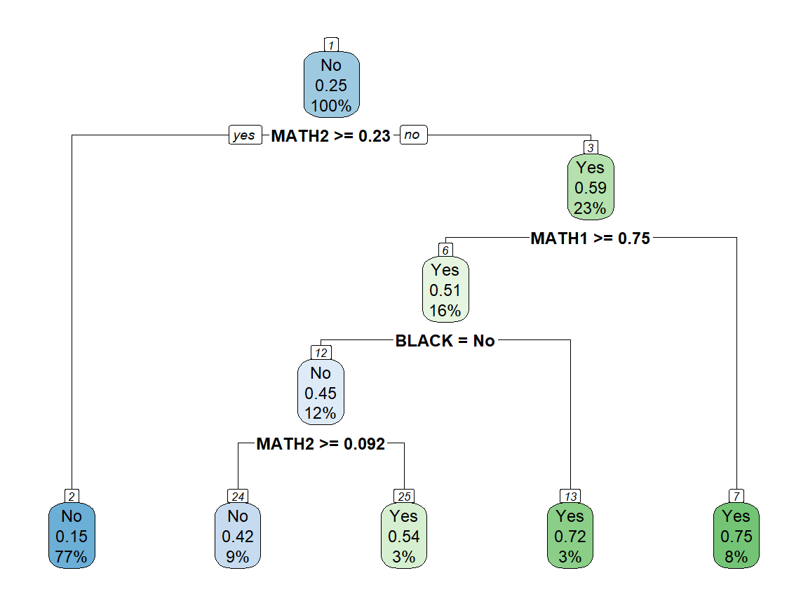
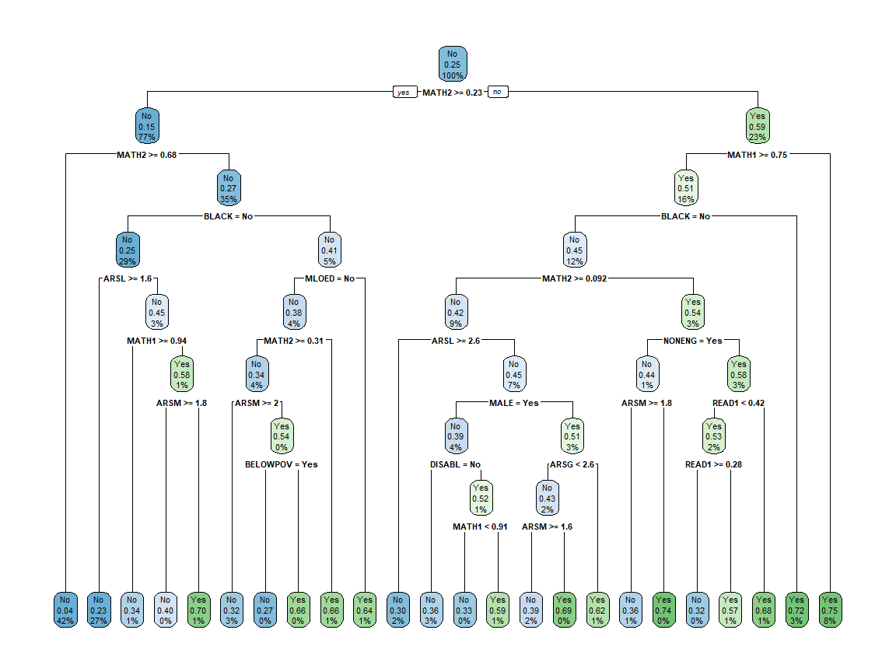
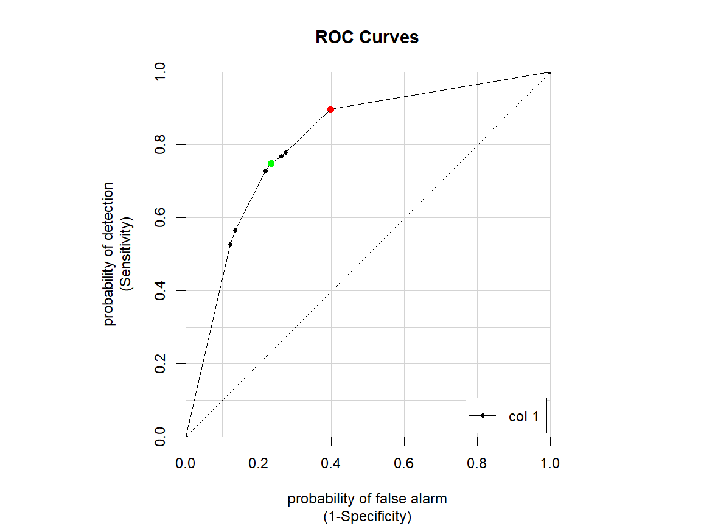
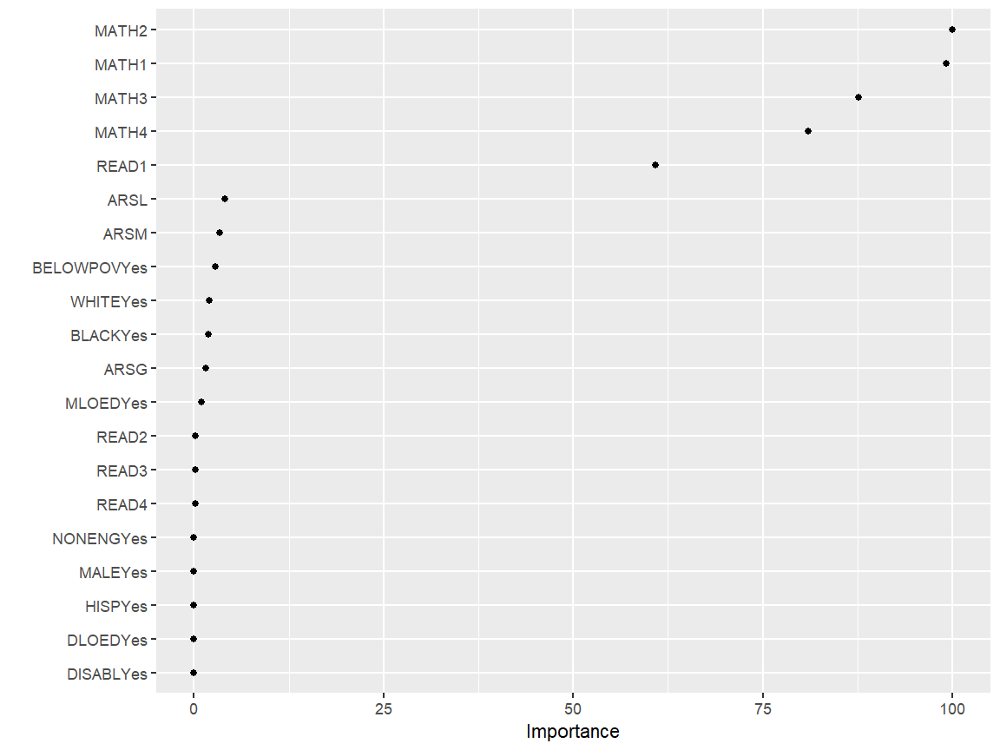

# Predicting Academic Risk
*Using machine learning in R to create an early warning system of academic risk.*

## Getting Started


For this guide, the user will need R, Rstudio, and the following helpful R packages:

- `caret`: Functions to streamline the model training process for complex regression and classification problems.
- `caTools`: Basic utility functions.
- `dplyr`: Functions for manipulating variables and tidying output.
- `rpart`: Recursive partitioning for classification, regression, and survival trees.
- `rpart.plot`: Plot an rpart model.
- `ROCR`: Flexible tool for creating curves of performance measures.
- `vip`: Framework for constructing variable importance plots.

You may need to install some packages before loading, using `install.packages("packagename")`.
Here is some code to install them:


```r
# Install add-on packages if needed.
install.packages("caret")
install.packages("caTools")
install.packages("dplyr")
install.packages("rpart")
install.packages("rpart.plot")
install.packages("ROCR")
install.packages("vip")
```

### Objective

In this guide, you will be able to use techniques in machine learning to tune, 
fit, and use a model that predicts whether students are at academic risk by third grade.

### Using this guide

This guide uses publicly-available data from the U.S. Department of Education's
[Early Childhood Longitudinal Study](https://nces.ed.gov/ecls/), Kindergarten 
Class of 1998-99 (ECLS-K). However, the guide can be modified to fit data from other education contexts.

### About the data

The ECLS-K focuses on children's early school experiences, beginning with kindergarten
and following children through middle school. The data provide descriptive information
on children's status at entry to school, their transition into school, and their
progression through 8th grade. The longitudinal nature of the ECLS-K data enables
researchers to study how a wide range of family, school, community, and individual
factors are associated with school performance.

The data associated with this guide were pulled from the National Center for Education
Statistics [Online Codebook](https://nces.ed.gov/OnlineCodebook/Session/Codebook/6c5af0be-772a-4cb8-9059-4297b831efef), which allows for selection of variables and access to 
documentation. Additional information can be found at the Inter-university Consortium
for Political and Social Research ([ICPSR](https://www.icpsr.umich.edu/web/ICPSR/studies/28023)). 
The rows are student level and the columns
include demographic and academic measures over time. Here are the relevant features from
the dataset that will be used for model fitting and analysis:

| Feature name        | Feature description                                               |
|:------              |:-----------------------------------------                         |
| `GENDER`            | Indicator: "1" if male, "2" if female                             |
| `WKWHITE`           | Indicator: "1" if white, "2" if not                               |
| `WKBLACK`           | Indicator: "1" if black, "2" if not                               |
| `WKHISP`            | Indicator: "1" if hispanic, "2" if not                            |
| `WKMOMED`           | Categorical: mother's education level                             |
| `WKDADED`           | Categorical: father's education level                             |
| `WKLANGST`          | Indicator: "1" if home language is English, "2" if not            |
| `WKPOV_R`           | Indicator: "1" if below poverty threshold, "2" if not             |
| `P1DISABL`          | Indicator: "1" if disabled, "2" if not                            |
| `P1HFAMIL`          | Categorical: family type                                          |
| `C1R4MPB1`          | Numeric: proficiency probability score for count, number, shape   |
| `C1R4MPB2`          | Numeric: proficiency probability score for relative size          |
| `C1R4MPB3`          | Numeric: proficiency probability score for ordinality, sequence   |
| `C1R4MPB4`          | Numeric: proficiency probability score for add/subtract           |
| `C1R4RPB1`          | Numeric: proficiency probability score for letter recognition     |
| `C1R4RPB2`          | Numeric: proficiency probability score for beginning sounds       |
| `C1R4RPB3`          | Numeric: proficiency probability score for ending sounds          |
| `C1R4RPB4`          | Numeric: proficiency probability score for sight words            |
| `C5R4MTSC`          | Numeric: math t-score                                             |
| `C5R4RTSC`          | Numeric: reading t-score                                          |
| `T1RARSMA`          | Numeric: mathematical thinking academic rating scale              |
| `T1RARSLI`          | Numeric: language and literacy academic rating scale              |
| `T1RARSGE`          | Numeric: general knowledge academic rating scale                  |

## Introduction

This guide demonstrates an introductory machine learning approach to 
developing a model for predicting if a student will be at risk of having
low academic performance in third grade. Such models can provide "early 
warning systems" for students identified at risk, allowing policymakers 
to develop interventions that target those students.

In this scenario, we are developing a predictive model for the state
of Eduphonia. The state would like a model that takes as input student-level
measurements of the features described in the table above and outputs a prediction
of whether the student will have trouble academically in third grade. The 
state's thinking is that if it can identify students likely to have academic
problems using data collected during the early elementary years, it can introduce 
targeted interventions to prevent those students from falling behind. However, 
the interventions are costly and cannot be given to all students. For the benefits 
to outweigh the costs, the model must not only accurately predict who is at risk, 
but also must limit identifying students as targets for intervention who would 
not have had academic troubles anyway.

This is a standard binary classification problem: we are predicting if a student will
fall into one category (at risk) or its opposite (not at risk). The student must
fall within one of those two categories. There are many techniques one could use to
do such a prediction, some more complex than others. Here, we demonstrate how to 
use a decision tree to illustrate its use in answering education questions.

## Setup

Let's call the packages we need.


```r
# Load the packages.
library(caret)
library(caTools)
library(dplyr)
library(rpart)
library(rpart.plot)
library(ROCR)
library(vip)
```

Now read in the data and make a copy to use. 


```r
# Read in the data. You can check your working directory with the getwd()
# command and change it with the setwd() command. 
load("eclsk.rdata")

# Create your own copy in mydata, which will allow you to more easily reuse
# the code for other datasets.
mydata <- eclsk
```

## Data exploration

Eduphonia wants the model to be based only on certain predictors. We will select for 
just those predictors and the outcome variables here:


```r
# Features listed in the table above to be retained in dataset and change 
# some labels.
features <- c(1:10,15:17,23:26,34:37,43,45)

# Select only those 23 features to be kept in the data. The dataset also
# includes other variables that we will not use in this analysis.
mydata <- subset(mydata[,features])

# Shows the dimensions of the data.
dim(mydata)
```

```
[1] 21409    23
```

We see that we have the 23 variables for more than 21,000 students. A lot
of data is required for making accurate prediction models and a dataset
of this size should be enough to build a quality model and to test its
effectiveness.

### The outcome 

Let's look at the outcome measures we are trying to predict.
We have two that we want to explore: third-grade math (`C5R4MTSC`) and reading 
(`C5R4RTSC`) scores. These variables taken directly from ECLS-K start with C5, 
which indicates a direct child assessment (C) collected in the fifth (5) round 
of data collection that occured in Spring 2002, when the students were in third 
grade.


```r
summary(mydata$C5R4MTSC)
```

```
   Min. 1st Qu.  Median    Mean 3rd Qu.    Max.    NA's 
  -9.00   43.79   51.67   50.52   57.50   83.72    6994 
```

This is a standardized measure, so it is not surprising that the mean is close
to 50. But we would not expect negative scores. Let's see the distribution.


```r
hist(mydata$C5R4MTSC)
```


It looks like we would expect except for those ones below zero. Let's examine those.


```r
print(table(mydata$C5R4MTSC[mydata$C5R4MTSC<0]))
```

```

-9 
41 
```

All -9. Though there were 6,994 NA's for students who did not participate in the
fifth round of data collection, there were also 41 who did not take the math 
assessments. The codebook uses -9 for not ascertained, as well as -1 for not 
applicable. 

We can reclassify those codes and create our at risk measures.


```r
# Change -1 and -9 to NA.
for (i in 1:ncol(mydata)) {
  mydata[,i][mydata[,i]=="-1"|mydata[,i]=="-9"] <- NA
}

# Define math and reading at risk variables based on the being in the lowest
# quartile of non-missing scores.
mydata$ATRISKM <- ifelse(mydata$C5R4MTSC<quantile(mydata$C5R4MTSC,na.rm=TRUE)[2],yes="Yes",no="No")
mydata$ATRISKR <- ifelse(mydata$C5R4RTSC<quantile(mydata$C5R4RTSC,na.rm=TRUE)[2],yes="Yes",no="No")
```

When we do our analyses, we will keep in mind that the at risk group is about 25% of the sample,
as prediction models can sometimes be insensitive to predicting minority outcomes. 

For now, let's focus on students who have data for our math outcome.


```r
# Define the outcome of interest and keep only non-missing values.
depvar <- "ATRISKM"
mydata <- mydata[!is.na(mydata[[depvar]]),]

# Take a look at the variables.
str(mydata)
```

```
tibble [14,374 x 25] (S3: tbl_df/tbl/data.frame)
 $ GENDER  : num [1:14374] 2 1 2 1 1 1 2 2 1 1 ...
 $ WKWHITE : num [1:14374] 1 1 1 1 1 1 1 1 1 1 ...
 $ WKBLACK : num [1:14374] 2 2 2 2 2 2 2 2 2 2 ...
 $ WKHISP  : num [1:14374] 2 2 2 2 2 2 2 2 2 2 ...
 $ WKMOMED : num [1:14374] 3 6 6 8 6 5 7 7 8 5 ...
 $ WKDADED : num [1:14374] 9 6 9 8 5 3 8 5 9 5 ...
 $ WKLANGST: num [1:14374] 2 2 2 2 2 2 2 2 2 2 ...
 $ WKPOV_R : num [1:14374] 2 2 2 2 2 2 2 2 2 2 ...
 $ P1DISABL: num [1:14374] 2 1 2 1 2 1 2 1 1 2 ...
 $ P1HFAMIL: num [1:14374] 1 1 1 1 1 2 1 1 1 1 ...
 $ T1RARSLI: num [1:14374] 3.46 2.58 4.04 2.28 2.28 1.9 2.58 4.74 4.74 2.28 ...
 $ T1RARSMA: num [1:14374] 3.44 2.56 4.42 2.34 2.34 1.72 2.56 3.77 5 2.45 ...
 $ T1RARSGE: num [1:14374] 3.65 2.95 4.4 2.67 2.67 1.75 3.44 4.92 4.63 2.26 ...
 $ C1R4RPB1: num [1:14374] 0.999 0.869 0.961 0.744 0.698 0.738 0.794 1 1 0.845 ...
 $ C1R4RPB2: num [1:14374] 0.964 0.212 0.478 0.111 0.091 0.108 0.14 0.996 0.994 0.183 ...
 $ C1R4RPB3: num [1:14374] 0.828 0.061 0.17 0.03 0.025 0.03 0.039 0.978 0.966 0.052 ...
 $ C1R4RPB4: num [1:14374] 0.171 0.001 0.003 0 0 0 0 0.785 0.674 0.001 ...
 $ C1R4MPB1: num [1:14374] 1 0.996 1 0.988 0.943 0.965 0.996 1 1 0.98 ...
 $ C1R4MPB2: num [1:14374] 0.994 0.751 0.989 0.53 0.205 0.291 0.764 0.997 1 0.416 ...
 $ C1R4MPB3: num [1:14374] 0.946 0.11 0.883 0.036 0.006 0.011 0.119 0.97 0.998 0.021 ...
 $ C1R4MPB4: num [1:14374] 0.279 0.003 0.145 0.001 0 0 0.003 0.419 0.903 0.001 ...
 $ C5R4RTSC: num [1:14374] 71.7 58.6 58.1 59.2 44.8 ...
 $ C5R4MTSC: num [1:14374] 60.4 56.4 53.2 55.9 40.9 ...
 $ ATRISKM : chr [1:14374] "No" "No" "No" "No" ...
 $ ATRISKR : chr [1:14374] "No" "No" "No" "No" ...
```

### Predictor features

There are a few more issues with the data we should address. In addition to the two variables
we just created, the first ten variables listed are categorical, but are classified as numeric.
The names and values are not always easy to understand. For example, `GENDER` takes on values of
1 and 2. Finally, some variables have more categories than we need, such as multiple levels of 
parent education. 


```r
# Replace some of the variable names with ones that are easier to understand and look at the data.
colnames(mydata)[1:4] <- c("MALE","WHITE","BLACK","HISP")
colnames(mydata)[7:9] <- c("NONENG","BELOWPOV","DISABL")
colnames(mydata)[11:13] <- c("ARSL","ARSM","ARSG")
colnames(mydata)[14:21] <- c("READ1","READ2","READ3","READ4","MATH1","MATH2","MATH3","MATH4")

# The education and household type variables have a wide range of categories. We will create 
# variables for mother and father less than high school education and single parent household.
mydata$MLOED <- ifelse(mydata$WKMOMED==1|mydata$WKMOMED==2,yes="Yes",no="No")
mydata$DLOED <- ifelse(mydata$WKDADED==1|mydata$WKDADED==2,yes="Yes",no="No")
mydata$SINGPAR <- ifelse(mydata$P1HFAMIL==3|mydata$P1HFAMIL==4,yes="Yes",no="No")

# Change categorical variables to factors (not numbers) and recode values for clarity.
factors <- c("MALE","WHITE","BLACK","HISP","NONENG","BELOWPOV","DISABL",
             "MLOED","DLOED","SINGPAR","ATRISKM","ATRISKR"
)
for (j in factors) {
  mydata[[j]][mydata[[j]]==1]<-"Yes"
  mydata[[j]][mydata[[j]]==2]<-"No"
  mydata[[j]]<-as.factor(mydata[[j]])
}

# Get rid of variables we do not need and look at a summary of each of the variables.
mydata[,c("WKMOMED","WKDADED","P1HFAMIL","c5R4RTSC","C5R4MTSC","C5R4RTSC")]<-list(NULL)
summary(mydata)
```

```
  MALE       WHITE       BLACK         HISP        NONENG      BELOWPOV    
 No :7085   No  :4395   No  :11714   No  :11236   No  :11692   No  :11077  
 Yes:7289   Yes :9282   Yes : 1963   Yes : 2441   Yes : 1969   Yes : 2666  
            NA's: 697   NA's:  697   NA's:  697   NA's:  713   NA's:  631  
                                                                           
                                                                           
                                                                           
                                                                           
  DISABL           ARSL            ARSM           ARSG           READ1       
 No  :10702   Min.   :1.020   Min.   :1.00   Min.   :1.020   Min.   :0.0010  
 Yes : 1667   1st Qu.:2.040   1st Qu.:1.99   1st Qu.:2.000   1st Qu.:0.4230  
 NA's: 2005   Median :2.480   Median :2.54   Median :2.460   Median :0.8280  
              Mean   :2.515   Mean   :2.59   Mean   :2.669   Mean   :0.6873  
              3rd Qu.:2.980   3rd Qu.:3.12   3rd Qu.:3.405   3rd Qu.:0.9760  
              Max.   :4.740   Max.   :5.00   Max.   :4.920   Max.   :1.0000  
              NA's   :2425    NA's   :4577   NA's   :3999    NA's   :2417    
     READ2            READ3            READ4            MATH1       
 Min.   :0.0000   Min.   :0.0000   Min.   :0.0000   Min.   :0.0130  
 1st Qu.:0.0330   1st Qu.:0.0090   1st Qu.:0.0000   1st Qu.:0.9470  
 Median :0.1670   Median :0.0470   Median :0.0010   Median :0.9930  
 Mean   :0.3211   Mean   :0.1829   Mean   :0.0363   Mean   :0.9262  
 3rd Qu.:0.5890   3rd Qu.:0.2370   3rd Qu.:0.0060   3rd Qu.:0.9990  
 Max.   :1.0000   Max.   :1.0000   Max.   :0.9990   Max.   :1.0000  
 NA's   :2417     NA's   :2417     NA's   :2417     NA's   :1673    
     MATH2            MATH3            MATH4        ATRISKM     ATRISKR     
 Min.   :0.0000   Min.   :0.0000   Min.   :0.0000   No :10780   No  :10706  
 1st Qu.:0.2160   1st Qu.:0.0070   1st Qu.:0.0000   Yes: 3594   Yes : 3557  
 Median :0.6450   Median :0.0630   Median :0.0020               NA's:  111  
 Mean   :0.5696   Mean   :0.2255   Mean   :0.0399                           
 3rd Qu.:0.9100   3rd Qu.:0.3490   3rd Qu.:0.0120                           
 Max.   :1.0000   Max.   :1.0000   Max.   :1.0000                           
 NA's   :1673     NA's   :1673     NA's   :1673                             
  MLOED        DLOED      SINGPAR    
 No  :11743   No  :9788   No  :9871  
 Yes : 1808   Yes :1460   Yes :2512  
 NA's:  823   NA's:3126   NA's:1991  
                                     
                                     
                                     
                                     
```

### Missing values

It looks like we have missing values for most of the variables. Various imputation 
and missing data handling methods exist, and best practices in machine learning for 
missing data is still an area of active research. 

One simple and computationally efficient way to handle missing data is to impute 
values of central tendency or commonality. For example, for continuous variables 
we would replace the missing values with simply the mean of the values for that 
feature. For categorical variables, we would impute the mode. 


```r
# Define the set of independent variables.
indepvar <- c("MATH1","MATH2","MATH3","MATH4","READ1","READ2","READ3","READ4","ARSL","ARSM","ARSG",
              "MALE","WHITE","BLACK","HISP","NONENG","BELOWPOV","DISABL","MLOED","DLOED","SINGPAR")

# Loop over the independent variables to deal with missing values.
# If the variable is a factor, assign it the modal value. Otherwise, assign the mean.
for (x in indepvar) {
  if (class(mydata[[x]])=="factor") {
    y <- mydata[[x]][complete.cases(mydata[[x]])]
    uy <- unique(y)
    mydata[[x]][is.na(mydata[[x]])] <- uy[which.max(tabulate(match(y,uy)))]
  } else {
    mydata[[x]][is.na(mydata[[x]])] <- mean(mydata[[x]],na.rm=TRUE)
  }
}
```

### Train and test sets

In predictive modeling, it is key to create a test set of data. 
The test set is data that is not used in the model fitting stage of the 
analysis. In other words, it is data that goes unseen by the model 
until we finalize our model. Then, we can test the model's predictive 
accuracy by using it to predict the outcomes on the previously unseen 
test set. The model's accuracy on the test data provides an estimate of how 
accurate it would be in predicting outcomes for completely new data
(often called out of sample data).

The data that is used in the model fitting stage is called the train set, 
since it is the data that is used to train the model's parameters. A 
conventional way to split a dataset between train and test sets is to randomly 
choose 80 percent of the data points to be in the train set and 20 percent of the data points 
to be in the test set. This means that the bulk of the information is being used 
to fit the model, which should lead to a more accurate model. Fewer data points 
are needed to provide an estimate of predictive accuracy, thus the test set is smaller.

Here, we split our data randomly between train and test sets:


```r
# Set the seed for replicability of pieces that involve random numbers.
set.seed(101)

# Create training (80%) and test (20%) splits of the data, maintaining the 
# proportion of the outcome (depvar) in both sets.
train_index <- as.vector(createDataPartition(mydata[[depvar]], p = .8, list = FALSE, times = 1))
mytrain <- mydata[train_index, ]  
mytest <- mydata[-train_index, ] 

#Show dimensions of both datasets
dim(mytrain)
```

```
[1] 11500    23
```

```r
dim(mytest)
```

```
[1] 2874   23
```

## Using `rpart`

The `rpart` package builds classification or regression models that can be represented
as binary trees. The package implements many of the ideas found in the CART (Classification
and Regression Trees) book and programs that Breiman, Friedman, Olshen, and Stone
described in 1984. However, CART is the trademarked name of a particular software 
implementation of the ideas, so Recursive PARTitioning, or `rpart`, was chosen.

The `rpart` algorithm works by splitting the dataset recursively, which means that the
subsets that arise from a split are further split until a predetermined termination 
criterion is reached. Splitting rules can be constructed in many ways, all of which 
are based on the notion of impurity, a measure of the degree of heterogeneity of the 
leaf nodes. At each step, the split is made based on the independent variable that 
results in the largest possible reduction in heterogeneity of the dependent variable.

It is important to note that the algorithm works by making the best possible choices at
each particular stage, without any consideration of whether those choices remain optimal
for fugure stages. That is, the algorithm makes a locally optimal decision at each stage.
It is quite possible that a choice at one stage turns out to be less than optimal for
the problem as a whole. In other worse, the algorithm does not find a globally optimal
tree.

### Splitting rules

Let's start out with the basic model.


```r
# Set up the formula for the model, with depvar as a function of the set of independent variables.
mymodel <- as.formula(paste(depvar,paste(indepvar,collapse=" + "), sep=" ~ "))

# Start with the basics. 
mytree.base <- rpart(mymodel,mytrain)
mytree.base
```

```
n= 11500 

node), split, n, loss, yval, (yprob)
      * denotes terminal node

 1) root 11500 2876 No (0.7499130 0.2500870)  
   2) MATH2>=0.2345 8822 1293 No (0.8534346 0.1465654) *
   3) MATH2< 0.2345 2678 1095 Yes (0.4088872 0.5911128)  
     6) MATH1>=0.7465 1786  875 Yes (0.4899216 0.5100784)  
      12) BLACK=No 1408  637 No (0.5475852 0.4524148)  
        24) MATH2>=0.0915 1012  423 No (0.5820158 0.4179842) *
        25) MATH2< 0.0915 396  182 Yes (0.4595960 0.5404040) *
      13) BLACK=Yes 378  104 Yes (0.2751323 0.7248677) *
     7) MATH1< 0.7465 892  220 Yes (0.2466368 0.7533632) *
```

This is a list of the splits in the decision tree. For example, all 11,500 students 
in the training set are included in the root node. These are split into two groups 
based on whether `MATH2` is greater than or equal to 0.2345. The child nodes of node 
$x$ are always $2x$ and $2x+1$. Node 2 includes 8,822 students for whom this is true, while 
node 3 has the other 2,678 students. The description of node 2 ends with a *, indicating
that it is a leaf node, with no further splits.

### Decision tree

Let's look at the tree.


```r
# Visualize the tree.
rpart.plot(mytree.base)
```


We now see a tree plotted with the root node at the top, which is split into two
branches based on the value of `MATH2`. Students with `MATH2` scores at or above the 
cutoff take the branch to the left, which is a leaf node (it has no further splits).
Students below the cutoff take the branch to the right, where they are split by 
another decision. All conditions are written so that students with a value of yes
are split to the left and students with a value of no are split to the right.

The splits continue to a set of leaf nodes that are presented along the bottom 
of the graph. Each node contains the value of that node, the share of students 
in that node who are at risk, and the percentage of all students who end up in that
node. For example, 77 percent of all students end up in the first leaf and are 
categorized as not at risk, though 15 percent of students in that leaf are at risk.

### Model fit

The rules for our tree have been stored in `mytree.base`. We can apply those rules to
the data to generate predicted values for being at risk. Then, we can compare how the 
predictions based on the model's decision rules compare to actual values. 


```r
# Predict a class value (at risk or not) for each student using the rules from 
# mytree1. Then compare the predictions to the actual values of at risk for the 
# students in the data set.
pred.base.train <- predict(mytree.base,mytrain,type="class")
table(pred.base.train,mytrain[[depvar]])
```

```
               
pred.base.train   No  Yes
            No  8118 1716
            Yes  506 1160
```

### Confusion matrix

This 2x2 table has many names, including confusion matrix and classification matrix.
It is one way that machine learning models are evaluated. The No and Yes rows represent 
the values predicted by applying our model rules to the training data. The No and Yes 
columns represent the actual values observed in the training data. The table presents 
the four possible combinations.

Two combinations describe students who were classified accurately:

True Positives (TP): prediction = Yes and actual = Yes. These students were accurately
identified as being at risk by our model.

True Negatives (TN): prediction = No and actual = No. These students were accurately 
identified as being not at risk by our model.

Two combinations describe students who were not classified accurately:

False Positives (FP): prediction = Yes and actual = No. These students were not at risk,
but our model identified them as being at risk. This Type I error could be a problem
if an intervention for at risk students is expensive and it is given to a lot of 
students who did not need it.

False Negatives (FN): prediction = No and actual = Yes. These students were at risk, but
our model did not identify them as being at risk. This Type II error may be more of
a concern, because it indicates missing students who are in need of intervention.

Our basic model identified about 40 percent (1160/(1160+1716)) at risk students. It also
had an overall accuracy of almost 81 percent ((1160+8118)/(1160+1716+8118+506)). However, 
consider that if we said that no students were at risk, our accuracy would be 75 percent.

We can also see how the model predictions would work for the test set. We can apply the rules from
the model to our test data to generate predicted values for being at risk. Then, we can 
compare how the predictions based on the model's decision rules compare to actual values.


```r
# Predict a class value for students in test set using rules from mytree1,
# then compare the predictions to the actual values of at risk..
pred.base.test <- predict(mytree.base,mytest,type="class")
table(pred.base.test,mytest[[depvar]])
```

```
              
pred.base.test   No  Yes
           No  2036  443
           Yes  120  275
```

The results for the test set are similar, identifying 38 percent of at risk students,
with an overall accuracy of 80 percent.

### Model tuning

Most machine learning algorithms have parameters that can be used to tune the model,
or improve the model's performance. However, it is possible to overuse these adjustments.
This relates to a well-known bias-variance tradeoff in machine learning, the
tradeoff between the degree to which a model fits the training data and its predictive
accuracy. There is a point at which it is counterproductive to improve the fit of a
model to the training data as this increases the likelihood of overfitting. As more 
splits are added, the data can be segmented into increasingly smaller groups that
successfully more split the training data. Deep trees are more likely to be driven by
idiosyncracies of the training data and lead to overfitting. There are two broad 
approaches for addressing this problem.

The first way to control overfitting, called pre-pruning, is to construct shallower 
trees by stopping the algorigthm based on one of the tuning parameters. In `rpart`, 
`minsplit` (default = 20) is the smallest number of observations in a node that allows 
it to be split further, `minbucket` (default = round(minsplit/3)) provides the smallest
number of observations that are allowed in a leaf, and `maxdepth` (default = 30)
prevents the tree from growing past a certain depth. Choosing different values of these 
parameters is not intuitive, as we may have no reason *a priori* to change `minsplit` 
from its default or know how much it should be changed.

The second approach to control overfitting is post-pruning, in which a we start by
growing a full tree with no limitations and then remove some branches based on some
criteria. This method is often more successful because it is not easy to precisely
estimate when to stop growing a tree. We will use `cp` (default = 0.01), which stands 
for complexity or cost parameter in `rpart`. It is the minimum improvement in the 
model needed to split a node based on a cost complexity measure. As the value of 
`cp` is lowered, nodes can be split with smaller gains. At the extreme, we can set 
`cp` to 0 to fully grow the tree.


```r
# Grow a full tree with the cost parameter set to 0. 
mytree.full <- rpart(mymodel,mytrain,cp=0)

# Confusion matrix for the full tree on training set.
pred.full.train <- predict(mytree.full,mytrain,type="class")
table(pred.full.train,mytrain[[depvar]])
```

```
               
pred.full.train   No  Yes
            No  8039 1018
            Yes  585 1858
```

```r
# Confusion matrix for the full tree on test set.
pred.full.test <- predict(mytree.full,mytest,type="class")
table(pred.full.test,mytest[[depvar]])
```

```
              
pred.full.test   No  Yes
           No  1889  385
           Yes  267  333
```

For the training set, the model correctly identified nearly 65 percent of at risk
students and had an 86 percent accuracy. However, for the test set, the model 
correctly identified 46 percent of at risk students and had a 77 percent accuracy.
This is an example of overfitting, in which the model did substantially better for
the training set, but the improvement did not carry over to the test set. In fact,
overall accuracy was reduced for the test set.


```r
# Show some diagnostics for the trees created.
plotcp(mytree.full)
```



The `rpart` procedure uses cross-validation (see below for details) to create 10 estimates
of trees for each value of the cost parameter. This figure shows the average error (or 
misclassification) rate for a part of the data held out from estimation at each value of `cp`. 
The number of splits are displayed across the top. In this unconstrained model, the final 
tree had 289 splits. We were able to fit the training data much better, but at the expense 
of having a very complicated model. We also see that the cross-validation error started
to rise as larger trees were grown, indicating that though the model was getting better
at matching the data it used for estimating, it was getting worse at making predictions
for out of sample data.

We would much rather have a less complicated tree that also does better at predicting.
One way to do that is to prune the tree at the lowest error.


```r
# Prune the tree at the cost parameter with the lowest error.
mytree.prune <- prune(mytree.full,cp=mytree.full$cptable[which.min(mytree.full$cptable[,"xerror"]),"CP"])

# Plot the tree.
rpart.plot(mytree.prune)
```



While the tree has been pruned considerably, it still has 23 splits over nine levels.
Let's take a look at how the model does with predictions. 


```r
# Confusion matrix for the base model on the test data.
pred.prune.train <- predict(mytree.prune,mytrain,type="class")
table(pred.prune.train,mytrain[[depvar]])
```

```
                
pred.prune.train   No  Yes
             No  8012 1430
             Yes  612 1446
```

```r
# Confusion matrix for the pruned model on the test data.
pred.prune.test <- predict(mytree.prune,mytest,type="class")
table(pred.prune.test,mytest[[depvar]])
```

```
               
pred.prune.test   No  Yes
            No  1985  388
            Yes  171  330
```
 
For the training set, the model correctly identified 50 percent of at risk students 
and had an 82 percent accuracy. For the test set, the model correctly identified 46 
percent of at risk students (just as with the full tree) and had an 83 percent accuracy.
So, when the tree was pruned, the model did better out of sample than with the overfitted
full tree.

We are improving the model, but we can still do better.

### Instability

There is one other aspect of trees we need to consider before we move forward. Decision trees
can be unstable, in that training a model with a slightly different sub-sample of data can 
cause the structure of the tree to change dramatically. Recall that we initially chose a seed
of 101 when we split the data. Let's choose two others and compare the trees that result from
a basic `rpart` analysis.


```r
# Set seed, create training split, and run model three times.
set.seed(101)
train.101 <- as.vector(createDataPartition(mydata[[depvar]], p = .8, list = FALSE, times = 1))
mytrain.101 <- mydata[train.101, ]  
mytree.101 <- rpart(mymodel,mytrain.101) 

set.seed(202)
train.202 <- as.vector(createDataPartition(mydata[[depvar]], p = .8, list = FALSE, times = 1))
mytrain.202 <- mydata[train.202, ]  
mytree.202 <- rpart(mymodel,mytrain.202) 

set.seed(303)
train.303 <- as.vector(createDataPartition(mydata[[depvar]], p = .8, list = FALSE, times = 1))
mytrain.303 <- mydata[train.303, ]  
mytree.303 <- rpart(mymodel,mytrain.303) 

# Plot three trees.
par(mfrow=c(2,2))
rpart.plot(mytree.101)
rpart.plot(mytree.202)
rpart.plot(mytree.303)
```


While there are certainly similarities, those are three trees with distinctly different rules.
Now we need some help.

## Using `caret`

The `caret` package, short for Classification And REgression Training, contains functions
to streamline the model training process for complex regression and classification problelms.
The package started as a way to provide a uniform interface across machine learning functions,
as well as a way to standardize common tasks such as parameter tuning and variable importance.
We can run `rpart` in `caret`, while taking advantage of its other features.


```r
# Recover our original training and test data sets for comparison.
mytrain <- mytrain.101
```

### Cross-validation

Cross-validation is a model validation technique for assessing how the results of an
analysis will generalize to an independent data set. It is mainly used in settings where
the goal is prediction and one wants to estimate how accurately a predictive model will
perform in practice. The goal of cross-validation is to test the model's ability to
predict new data that was not used in estimating it, in order to flag problems like
overfitting, and to give an insight on how the model will generalize to an independent
dataset.

One round of cross-validation involves partitioning a sample of data into complementary
subsets, performing an analysis on one subset and validating the analysis on the other
subset. To reduce variability, most methods include multiple rounds of cross-validation
using different partitions, and the validation results are averaged over the rounds to
give an estimate of the model's predictive performance.

In $k$-fold cross-validation, the original sample is randomly partitioned into k equal
sized subsamples. One of the $k$ subsamples is retained as the validation data for 
testing the model, and the remaining $k-1$ subsamples are used as training data. This 
process is then repeated k times, with each of the $k$ subsamples used exactly once as
validation data. The $k$ results can then be averaged to produce a single estimation. The
advantage of this method is that all observations are used for both training and
validation, and each observation is used for validation exactly once. Ten-fold 
cross-validation is commonly used. 

Here is pseudocode that succinctly summarizes the structure of cross-validation:

```
For each of the k folds
  Fit model on the all but one of the training sets
  Test model prediction accuracy on the test set
  Store performance measure
Take the average of the performance measure over k folds
```

Repeated $k$-fold cross-validation takes this a step further. The entire process is 
repeated $n$ times, with a new set of $k$ random partitions created each time.


```r
# Basic caret model using rpart and repeated cross-validation.
mycaret <- train(              # Caret procedure to train models
  mymodel,                     # Same model as before
  data = mytrain,              # Using the training dataset
  method = "rpart",            # Analysis with rpart
  trControl = trainControl(
    method = "repeatedcv",     # Repeated cross-validation
    number = 10,               # Number of folds (k)
    repeats = 10               # Number of times (n) to repeat the cross-validation
    )
  )
mycaret
```

```
CART 

11500 samples
   21 predictor
    2 classes: 'No', 'Yes' 

No pre-processing
Resampling: Cross-Validated (10 fold, repeated 10 times) 
Summary of sample sizes: 10350, 10350, 10351, 10351, 10350, 10349, ... 
Resampling results across tuning parameters:

  cp          Accuracy   Kappa    
  0.01112656  0.8026526  0.3707625
  0.02329624  0.7987567  0.3751127
  0.16968011  0.7590960  0.1140637

Accuracy was used to select the optimal model using the largest value.
The final value used for the model was cp = 0.01112656.
```

The output shows a CART estimation with repeated cross-validation conducted at three tuning values
of `cp`, the cost parameter for `rpart`. This is the default for `train`. For each level of `cp`,
we see two measures of model fit, Accuracy and Kappa. The final model was chosen based on highest
accuracy and can be found in `mycaret$finalModel`.

### Model tuning

Now we can add a little more functionality from `caret`. First, we can set up some controls
and have `caret` tune the model using the same `cp` parameter as `rpart`. We have chosen to
let `caret` evaluate 25 different values of `cp`; alternatively, we could tell it to use 
specific values in tuning.


```r
# Set up the controls for the analysis.
mycontrol <- trainControl(
  method = "repeatedcv", 
  number = 10, 
  repeats = 10,
  savePredictions = "final",   # Save predictions for the optimal tuning parameters
  classProbs = TRUE            # Compute class probabilities for classification models
)

# Rerun with the addition of tuning.
mycaret <- train(              
  mymodel,                     
  data = mytrain,              
  method = "rpart",            
  trControl = mycontrol,       # Use the set of controls specified above
  tuneLength = 25              # Try 25 different values of the tuning parameter (cp)
  )
mycaret
```

```
CART 

11500 samples
   21 predictor
    2 classes: 'No', 'Yes' 

No pre-processing
Resampling: Cross-Validated (10 fold, repeated 10 times) 
Summary of sample sizes: 10349, 10351, 10350, 10350, 10349, 10350, ... 
Resampling results across tuning parameters:

  cp            Accuracy   Kappa    
  0.0002483608  0.7812689  0.3768733
  0.0003477051  0.7848344  0.3831344
  0.0004346314  0.7905128  0.3962310
  0.0004636069  0.7911997  0.3972380
  0.0005215577  0.7935388  0.4021562
  0.0005408747  0.7938258  0.4025290
  0.0005795086  0.7954264  0.4065184
  0.0005960660  0.7966260  0.4083131
  0.0006954103  0.8000867  0.4170846
  0.0008692629  0.8030350  0.4252973
  0.0009272137  0.8037829  0.4270431
  0.0010431154  0.8046961  0.4298218
  0.0012169680  0.8061654  0.4336668
  0.0013038943  0.8063828  0.4337121
  0.0013908206  0.8063915  0.4326265
  0.0015646732  0.8062784  0.4316650
  0.0017385257  0.8061739  0.4308378
  0.0019123783  0.8062435  0.4291232
  0.0026657395  0.8050004  0.4168676
  0.0038247566  0.8038525  0.3991798
  0.0041724618  0.8032352  0.3943720
  0.0042883635  0.8030788  0.3928125
  0.0111265647  0.8024871  0.3726251
  0.0232962448  0.7986084  0.3758081
  0.1696801113  0.7590527  0.1178511

Accuracy was used to select the optimal model using the largest value.
The final value used for the model was cp = 0.001390821.
```

### Performance metrics

Again, for each value of the tuning parameter, `caret` has reported two measures of performance:
Accuracy and Kappa. Accuracy is the same measure we presented earlier in the discussion
of the confusion matrix, which is the share of all students who fall into the true positive
or true negative categories. Kappa is a measure of how closely  model predictions match the
actual classification, controlling for the accuracy of a random classifier as measured by
expected accuracy. This is especially useful when one group is much more common than the other. 
With this kind of unbalanced data, there is a higher chance that a student will randomly 
be classified in the more common group. Kappa tries to account for that expectation.

In the output above, the model with the largest accuracy was selected as the optimal model. 
Kappa could also have been used to identify an optimal model, and in this case, the two would 
have been very similar. 

There are many performance measures that can be used to select models. By setting the 
`summaryFunction` to `twoClassSummary`, `caret` provides other common measures,
including sensitivity and specificity. Sensitivity is the percentage of actual positives 
that were correctly predicted; that is, what fraction of all of the actual positives were 
identified as positive. Sensitivity matters when classifying the positives correctly is
more important than classifying the negatives, such as identifying people at risk for a
malignant disease. Specificity is the proportion of actual negatives that were correctly 
predicted; that is, what fraction of all of the actual negatives were identified as 
negative. Specificity is more relevant when it is important to avoid negatives being classified
as positive, such as real emails being classified as spam. 

Several other measures can be calculated and used by `caret`, but it also allows
users to create their own measures. We will see more clearly later that there is a tradeoff
between sensitivity and specificity. One approach to balancing the tradeoff is to give them
equal weight, so we will create a measure that is the sum of the two and use it as our
performance metric to evaluate the model.

Finally, we will make one more change. The "one standard error rule" is often applied when
selecting models through cross-validation. Looking back at the graph of cross-validation 
error, there is a line that indicates a level one standard error above the minimum. Rather
than selecting the value of the tuning parameter that gives the minimum error, many 
procedures select the smallest model that is within one standard error. This is another
approach to identify more parsimonious models that still perform well.


```r
# Create a performance metric that is the sum of sensitivity and specificity.
mymetric <- function(data, lev = levels(data$obs), model = NULL) {
  out <- c(twoClassSummary(data, lev = levels(data$obs), model = NULL))
  ss <- out["Spec"] + out["Sens"]
  c(out, SS = ss)
}

# Change our controls to use the new metric.
mycontrol <- trainControl(
  method = "repeatedcv", 
  number = 10, 
  repeats = 10,
  savePredictions = "final",   
  classProbs = TRUE,    
  summaryFunction = mymetric,  # Use our metric to evaluate the model. 
  selectionFunction = "oneSE"  # Choose simplest model within one SE of the best.
)
```

### Loss function

Finally, our current problem of interest is likely one in which we may care about some 
errors more than others. For example, Eduphonia may be concerned about identifying as 
many at risk students as possible, even if it means classifying more students at risk 
who actually are not. Rather than focusing solely on the rate of classifying those 
students, we can change the relative importance of errors by adding a loss function. 
The loss function is another parameter that can be set in `rpart`, but neither `rpart` 
nor `caret` include the ability to examine a range of penalties. So, we will create our 
own approach.

Here is pseudocode from earlier, with the addition of repeated cross-validation, parameter
tuning within `caret`, and our own penalty tuning using the loss function:

```
For each value of the penalty
  For each value of the tuning parameter cp
    For each of the n repeats
      Create a random set of k folds
      For each of the k folds
        Fit model on the all but one of the training sets
        Test model prediction accuracy on the test set
        Store performance measure
      Take the average of the performance measure over k folds
    Take the average of the performance measure of n repeats
  Select the value of the tuning parameter cp that produced the highest performance measure
Select the value of the penalty that produced the highest performance measure
```

First, some set up.


```r
# Create a matrix with penalties for false negatives and other variables to collect.
mygrid <- expand.grid(penalty=seq(1,5,1),ss=0,cost=0)

# A place to store all of the models.
models <- list()
```

Then, run the models. Note that there are 10 folds * 10 repeats * 25 values of cp * 5 values
of penalty = 12,500 models that are being run. (This takes a few minutes.)


```r
# For each of the possible penalties, run the CART model.
for (g in 1:nrow(mygrid)) {
  models[[g]] <- train(         
    mymodel,                   
    data = mytrain,            
    method = "rpart",           
    metric = "SS.Spec",        # Our metric as returned from the function we defined.
    trControl = mycontrol, 
    tuneLength = 25, #
    parms = list(loss=matrix(c(0,1,mygrid$penalty[g],0),byrow=TRUE,nrow=2)) # False negative penalty.
  )
  best <- which.max(models[[g]]$results$SS.Spec)        # Find the model with the highest metric value.
  mygrid$ss[g] <- models[[g]]$results$SS.Spec[best]     # Store the value of the metric.
  mygrid$cost[g] <- models[[g]]$results$cp[best]        # Store the value of the tuning parameter.
}

# The best model for each penalty examined.
mygrid
```

```
  penalty       ss        cost
1       1 1.394563 0.001216968
2       2 1.489439 0.169680111
3       3 1.501889 0.001216968
4       4 1.481737 0.001912378
5       5 1.470560 0.001564673
```

### Optimal model

This table above reports our metric and `cp` for the best model using each penalty level. 
Across the penalty levels, we see that the metric is highest for a penalty of 3.


```r
# The best model across all penalty levels.
mytree <- models[[which.max(mygrid$ss)]]
mytree
```

```
CART 

11500 samples
   21 predictor
    2 classes: 'No', 'Yes' 

No pre-processing
Resampling: Cross-Validated (10 fold, repeated 10 times) 
Summary of sample sizes: 10349, 10350, 10349, 10350, 10351, 10351, ... 
Resampling results across tuning parameters:

  cp            ROC        Sens       Spec       SS.Spec 
  0.0002483608  0.7936988  0.7515528  0.6976798  1.449233
  0.0003477051  0.7985557  0.7466826  0.7185377  1.465220
  0.0004346314  0.8028523  0.7442595  0.7304626  1.474722
  0.0004636069  0.8044541  0.7420094  0.7341840  1.476193
  0.0005215577  0.8077624  0.7416169  0.7423859  1.484003
  0.0005408747  0.8079666  0.7415816  0.7430112  1.484593
  0.0005795086  0.8080509  0.7410599  0.7457906  1.486850
  0.0005960660  0.8091864  0.7399349  0.7493391  1.489274
  0.0006954103  0.8097454  0.7408045  0.7515001  1.492305
  0.0008692629  0.8108445  0.7422193  0.7552536  1.497473
  0.0009272137  0.8122847  0.7420334  0.7576541  1.499688
  0.0010431154  0.8134617  0.7415114  0.7601561  1.501667
  0.0012169680  0.8119939  0.7420444  0.7598443  1.501889
  0.0013038943  0.8100513  0.7421254  0.7583495  1.500475
  0.0013908206  0.8093435  0.7421951  0.7585575  1.500753
  0.0015646732  0.8079870  0.7418698  0.7586933  1.500563
  0.0017385257  0.8065410  0.7418118  0.7583097  1.500122
  0.0019123783  0.8053142  0.7413135  0.7585857  1.499899
  0.0026657395  0.7999863  0.7432284  0.7547613  1.497990
  0.0038247566  0.7928007  0.7299495  0.7634892  1.493439
  0.0041724618  0.7898169  0.7240951  0.7682788  1.492374
  0.0042883635  0.7890690  0.7222274  0.7696377  1.491865
  0.0111265647  0.7394537  0.6005334  0.8783740  1.478907
  0.0232962448  0.7394537  0.6005334  0.8783740  1.478907
  0.1696801113  0.7394537  0.6005334  0.8783740  1.478907

SS.Spec was used to select the optimal model using  the one SE rule.
The final value used for the model was cp = 0.001912378.
```

Predictions from the final model.


```r
# Use the parameters from the best model to predict risk probabilities using 
# the test data.
pred.caret.full <- predict(mytree,mytest,type="prob")[,2]
```

## Informing decisions

Previously, our next step would be to compare the predictions to the actual values using some
code that automatically split the probabilities into  classes using a threshold of 0.5. 
But that is just one possibility. We can actually consider
a whole range of thresholds for splitting those probabilities and examine the implications for how
well our model classifies students. Doing this by hand is cumbersome, so we can use some procedures
to calculate every possible threshold. 

### ROC curve

For every threshold, the probabilities are converted to classes. Then we could create the 2x2
confusion matrix, which includes the true positive (correctly identifying those at risk) and false
positive (incorrectly identifying those not at risk) rates. The plot of these two rates for all 
possible thresholds is called the receiver operating characteristic (ROC) curve. It was developed
during World War II to analyze radar signals; no one remembers the acronym. This curve is a nice
tool for summarizing the performance of a classifier over all possible thresholds. 


```r
# Use the predicted probabilities to calculate all possible combinations of 
# true positive and false positive rates.
perf <- performance(prediction(pred.caret.full,mytest[[depvar]]),"tpr","fpr")

# Plot all the combinations in a ROC curve.
par(pty="s")
plot(perf,colorize=TRUE,print.cutoffs.at=seq(0,1,by=0.1),text.adj=c(-0.2,1.7))
abline(0,1,lty=2)
```


The figure above plots the true positive rate against the false positive rate. Imagine
starting at the origin and moving upward along the colored line. Initially, our true
positive rate - correctly identifying students who are at risk - increases much more 
quickly than our false positive rate - incorrectly identifying students who are not at 
risk. As we identify more at risk students, those two rates become more similar, until
eventually the only way we can identify more at risk students is to incorrectly classify
many more students who are not at risk. 

The colored line is the ROC curve and one measure of model performance is the area under
that curve (AUC). The dashed line represents a completely random model and has an AUC of 0.5.
A perfect model would have an ROC curve that went up the left side of the figure and then
across the top, which would have an AUC of 1. The points along the ROC are the thresholds
for classifying probabilities. For example, if we used 0.2 as the probability threshold, 
classifying everyone with a probability above 0.2 as at risk and everyone else as not at
risk, we would have a true positive rate of about 85 percent and a false positive rate of
about 40 percent. As we increase the threshold, fewer people are classified as at risk,
so the true positive rate falls as we move toward the origin.

### Threshold selection

Choosing a threshold involves tradeoffs. Let's use some metrics to compare the points
and make selections. First, we will pull information from the ROC curve points, and then
we will use the information to construct two measures.


```r
# Pull out the coordinates from the curve.
cutoffs <- data.frame(
  cut=perf@alpha.values[[1]], 
  fpr=perf@x.values[[1]], 
  tpr=perf@y.values[[1]], 
  youden=perf@y.values[[1]]+(1-perf@x.values[[1]])-1,
  f1=2*(perf@y.values[[1]]/(perf@y.values[[1]]+perf@x.values[[1]]))*perf@y.values[[1]]/(perf@y.values[[1]]/(perf@y.values[[1]]+perf@x.values[[1]])+perf@y.values[[1]])
)

# Print values of measures for all cutoffs.
cutoffs
```

```
          cut       fpr       tpr      youden        f1
1         Inf 0.0000000 0.0000000 0.000000000       NaN
2  0.59111277 0.1215213 0.5264624 0.404941060 0.6389170
3  0.41269841 0.1363636 0.5654596 0.429095974 0.6645339
4  0.37556155 0.2193878 0.7284123 0.509024501 0.7479333
5  0.35664336 0.2346939 0.7493036 0.514609744 0.7553473
6  0.32669323 0.2620594 0.7688022 0.506742859 0.7571193
7  0.30370370 0.2741187 0.7785515 0.504432794 0.7585744
8  0.19972261 0.3974954 0.8969359 0.499440571 0.7818373
9  0.06047438 0.9962894 1.0000000 0.003710575 0.6674923
10 0.03846154 1.0000000 1.0000000 0.000000000 0.6666667
```

The Youden statistic is similar to the measure we used above for finding the best model. F1 uses
a harmonic mean to combine information rather than simple addition. Both of these attempt to 
use multiple pieces of information to create a statistic that can be compared across points. 
Based on our calculations, we can find the thresholds that maximize both of these statistics.


```r
# Point with highest Youden statistic.
thy <- cutoffs[which.max(cutoffs$youden), "cut"]
cuty <- ifelse(pred.caret.full >= thy,yes="Yes",no="No")
cmy <- confusionMatrix(data=as.factor(cuty),reference=as.factor(mytest[[depvar]]),positive="Yes")

# Point with highest F1 statistic.
cutoffs <- cutoffs[order(cutoffs$f1, decreasing=TRUE),]
thf <- head(subset(cutoffs,f1<10))[1,1]
cutf <- ifelse(pred.caret.full >= thf,yes="Yes",no="No")
cmf <- confusionMatrix(data=as.factor(cutf),reference=as.factor(mytest[[depvar]]),positive="Yes")
```

We can re-plot the ROC curve and add points that maximize the metrics.


```r
# Plot the ROC curve with and points for each cutoff combination.
par(pty="s")
colAUC(pred.caret.full,mytest[[depvar]],plotROC=TRUE)
```

```
                [,1]
No vs. Yes 0.8102193
```

```r
abline(0,1,lty=2)
points(x=(1-cmf$byClass[2]),y=cmf$byClass[1],pch=19,col="red")       # Youden
points(x=(1-cmy$byClass[2]),y=cmy$byClass[1],pch=19,col="green")     # F1
```


The red dot is the threshold that maximizes the Youden statistic and the green dot is the
threshold that maximizes the F1 statistic. And above the figure, the AUC is reported to be 0.81.

### Confusion matrix

Let's look more closely at the first dot.


```r
# The confusion matrix using the cutoff based on the Youden statistic.
cmy
```

```
Confusion Matrix and Statistics

          Reference
Prediction   No  Yes
       No  1650  180
       Yes  506  538
                                          
               Accuracy : 0.7613          
                 95% CI : (0.7453, 0.7768)
    No Information Rate : 0.7502          
    P-Value [Acc > NIR] : 0.08685         
                                          
                  Kappa : 0.4469          
                                          
 Mcnemar's Test P-Value : < 2e-16         
                                          
            Sensitivity : 0.7493          
            Specificity : 0.7653          
         Pos Pred Value : 0.5153          
         Neg Pred Value : 0.9016          
             Prevalence : 0.2498          
         Detection Rate : 0.1872          
   Detection Prevalence : 0.3633          
      Balanced Accuracy : 0.7573          
                                          
       'Positive' Class : Yes             
                                          
```

Here is a confusion matrix along with several other measures, some we have already seen. The 2x2 table
is the same as the ones we have already created, with reference (actual) values in the columns and 
predictions in the rows. The lower right cell shows that we correctly identified 538 at risk students.
Above that, we see the other 180 at risk students who were not identified as at risk. And in the bottom
left, we see 506 students who were not actually at risk, but were classified at risk.

Our overall accuracy is 76 percent, but recall that we did not necessarily want a model that maximized
accuracy, as we wanted to give more weight to identifying at risk students. Sensitivity is the true
positive rate and specificity is the true negative rate. Note that the ROC curve plots sensitivity 
against (1 - specificity). As this metric was created to maximize the sum, it is not too surprising
that the rates are similar.

Two other important measures are the positive and negative predicted value rates. The negative predicted
value is computed from the two cells in the top row. Of all predictions that a student was not at risk,
90 percent of them were actually not at risk. Similarly, the positive predicted value is computed from
the two cells in the bottom row. Of all predictions that a student was at risk, just over half of them
were actually at risk.

Now let's look at the other selected threshold.


```r
# The confusion matrix using the cutoff based on the F1 statistic.
cmf
```

```
Confusion Matrix and Statistics

          Reference
Prediction   No  Yes
       No  1299   74
       Yes  857  644
                                          
               Accuracy : 0.6761          
                 95% CI : (0.6586, 0.6932)
    No Information Rate : 0.7502          
    P-Value [Acc > NIR] : 1               
                                          
                  Kappa : 0.3662          
                                          
 Mcnemar's Test P-Value : <2e-16          
                                          
            Sensitivity : 0.8969          
            Specificity : 0.6025          
         Pos Pred Value : 0.4290          
         Neg Pred Value : 0.9461          
             Prevalence : 0.2498          
         Detection Rate : 0.2241          
   Detection Prevalence : 0.5223          
      Balanced Accuracy : 0.7497          
                                          
       'Positive' Class : Yes             
                                          
```

This threshold correctly identifies 90 percent of at risk students, but can only do so by 
incorrectly identifying many more students who are not at risk. 

### Decision tree

Let's look at our final tree using the threshold based on the Youden statistic.


```r
# The final decision tree.
rpart.plot(
  mytree$finalModel,     # Final model from caret estimation
  box.palette="GnRd",    # Palette of green and red for notes
  pal.thresh=thy,        # Color node using Youden statistic threshold
  type=0,                # Basic tree plot
  extra=107,             # Show fraction of risk in node and percentage of all students
  shadow.col="gray",     # Gray shadows
  branch.lty=3,          # Dotted branches
  leaf.round=0,          # Square leaf nodes
  xflip=T,               # Flip horizontally so riskier on left
  cex=.8                 # Font size
)
```



This tree is flipped horizontally so that the rules are easier to interpret and the
at risk nodes are on the left. The first node splits students by their `MATH2` score.
Students with a score of at least 0.58 take the right branch, which ends in a leaf.
The green leaf indicates that everyone in it is categorized as not at risk. Nearly
one-half (48 percent) of all students we examined fall into this leaf, and 6 percent
of them were actually falling behind academically by third grade.

Taking the left branch from the first node, we have another rule based on `MATH2`
score. Students with a score lower than 0.23 that the left branch, which ends in a
leaf. The red leaf indicates that everyone in it is categorized as at risk. Nearly
one-quarter (23 percent) of all students we examined fall into this leaf, and 59
percent of them were actually falling behind academically by third grade.

Combined, splitting `MATH2` into three groups based on scores of 0.23 and 0.58 
classifies 71 percent of the students. The remaining 29 percent, who had `MATH2`
scores between 0.23 and 0.58, face more splitting rules. These are the students 
who are harder to distinguish, and the model used several other variables to try 
to split students into groups. 

We can also plot the tree using the threshold based on F1. 


```r
# The final decision tree using other threshold.
rpart.plot(
  mytree$finalModel,
  box.palette="GnRd",
  pal.thresh=thf,
  type=0,
  extra=107,
  shadow.col="gray",
  branch.lty=3,
  leaf.round=0,
  xflip=T,
  cex=.8
)
```


The rules and sorting of students is the same, but the classification of some leaves
in the middle `MATH2` range has changed from not at risk to at risk. This is where we
face the tradeoff from the threshold choice: we are able to correctly identify more
at risk students, but only at the cost of also misclassifying more students who are
not at risk.

### Variable importance

While the tree provides splits based on a set of predictors, we can also take a
look at the importance of each of the variables in the model.


```r
# Importance of variables in the model.
par(pty="m")
vip(mytree,geom="point",20)
```



This figure gives an idea of how important each variable was (or could have been) in 
creating the tree. Variable importance is computed based on the sum of the contribution 
of a variable at each split. Since there are candidate variables that are important 
but not used in a split, the top competing variables are also computed. The values are
then scaled so the top variable has an importance of 100.

We see that `MATH2` had the highest importance, which is consistent with what we saw
in the tree. However, we also see that `MATH1`, `MATH3`, and `MATH4` also had high values
of importance, but none of them appear as splits in the tree. It is likely that these
measures could also have been used for the splits, but splitting using `MATH2` was 
slightly better for the algorithm. In fact, the very first tree we plotted used both
`MATH2` and `MATH1` for splits. It is also interesting that `READ1` played a similar role.

Some of the next variables, including `WHITE` and `BELOWPOV`, have importance values
that are just slightly above 0. However, they are used in the tree, indicating that at 
those points, they were the most informative variables to use to split the tree further.

## Presenting options

To determine a final cutpoint (and tree), the context of the problem is key. In the case of 
predicting academic risk, Eduphonia may value maximizing true positives over 
minimizing false negatives. In other words, they might rather err on the side of over-predicting 
risk rather than under-predicting them.

If the goal is to minimize the number of students with academic difficulties, giving
an intervention to a student not at risk (a false positive) has far fewer consequences 
than failing to provide interventions to a student who would otherwise be at risk (a 
false negative). In addition, a student who receives an intervention will most likely 
benefit from that intervention, regardless of whether they would have strugged academically. 
By contrast, a student who fails to receive an intervention and falls behind will likely 
face hardships because of it.  

However, false positives have costs. It is impossible to give costly interventions to 
all students. An analyst would need to meet with policymakers and stakeholders to 
collectively decide the cutpoint at which they would be comfortable providing 
intervention services.

To inform this discussion, it is often helpful to frame the problem in terms
of raw numbers, rather than probabilities. For example, suppose Eduphonia has 
1,000 Kindergarteners and the data shows that 25 percent of them will fail to 
make adequate academic progress by third grade. In the model above, one cutpoint 
yielded a 90 percent true positive rate and 40 percent false positive rate, while
the other had true and false positive rates of 75 and 77 percent, respectively.

We could present the following to stakeholders: 

```
In Eduphonia, typically 25 percent of Kindergarteners fail to make adequate
academic progress by third grade. So, among our 1,000 current Kindergarteners
we would expect 0.25 * 1,000 = 250 to be at risk. Our model tells us the 
probability that each Kindergartener will fall behind. The task is to decide when
this probability gets high enough that we start giving an intervention.

If we decide that we should give interventions to students with a probability
of risk of 20 or higher, that would mean that about 0.9 * 250 = 225 of the
250 future at risk students would receive the intervention. In addition, of the 750
students not at risk, about 0.4 * 750 = 300 of them would also receive the 
intervention. In total, about 525 students would receive the intervention.

If we raise the threshold to 35, about 0.75 * 250 = 187 of the
250 future at risk students would receive the intervention, along with
about 0.23 * 750 = 173 of students not at risk. In total, about 360 students
would receive the intervention. Overall, we would reduce costs by giving the
intervention to 165 fewer students, but we would identify 38 fewer students 
who are academically at risk.
```

We can provide multiple numerical estimates for different cutpoints to stakeholders,
who would then decide on the specific rules based on their resources and preferences. 

---


