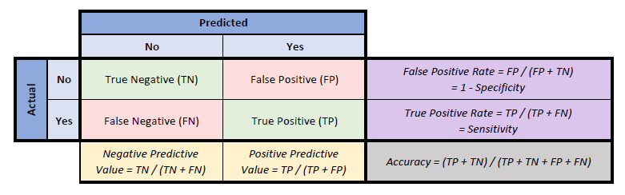
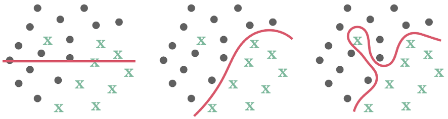
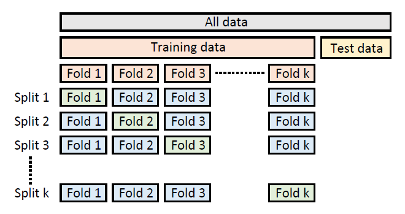
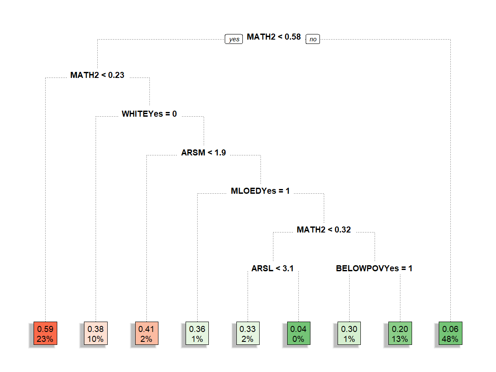
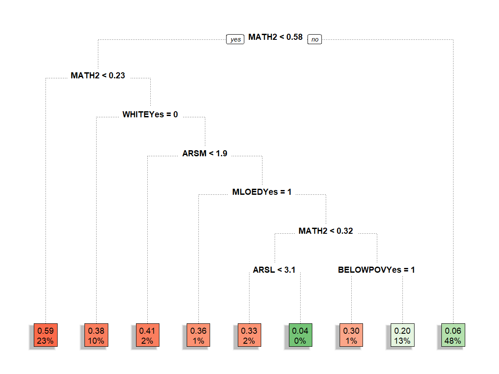

<!--html_preserve--><script>
  addClassKlippyTo("pre.r, pre.markdown");
  addKlippy('left', 'top', '#BEBEBE', '1', 'Copy code', 'Copied!');
</script><!--/html_preserve-->

<style>
p.comment {
background-color: #abe4d4;
class: success;
padding: 10px;
width: 50%;
margin-left: 25px;
font-size: 8pt;
float: right;
position: relative;
}

p.code {
background-color: #bcbcbc;
padding: 10px;
font-family: Courier, monospace;
font-size: 10pt;
}

p.present {
background-color: #ffa54f;
padding: 10px;
font-size: 10pt;
}
</style>

# Predicting Academic Risk
*Using CART analysis in R to create an early warning system of academic risk.*

This guide demonstrates an introductory machine learning approach to 
developing a model for predicting if a student will be at risk of having
low academic performance in third grade. Such models can provide "early 
warning systems" for students identified at risk, allowing policymakers 
to develop interventions that target those students.

The guide provides black boxes of annotated programming code (that include a button at the
upper left corner to copy to the clipboard), along with associated output in blue boxes and figures,
to demonstrate how to run a CART analysis. The main text explains the purpose of each step and how
it applies to the problem of interest. The guide includes a number of steps that are useful to
illustrate particular issues to consider when conducting the analysis. However, not all of the 
steps need to be repeated in conducting your own analysis. A summary of the key components is 
provided at the end of the document. Finally, the green side boxes provide additional information
on specific topics. 

## Overview

In this scenario, you are developing a predictive model for the state
of Eduphonia. The state would like a model that takes as input student-level
measurements of the features described in the table above and outputs a prediction
of whether the student will have trouble academically in third grade. The 
state's thinking is that if it can identify students likely to have academic
problems using data collected during the early elementary years, it can introduce 
targeted interventions to prevent those students from falling behind. However, 
the interventions are costly and cannot be given to all students. 

> For the benefits to outweigh the costs, the model must not only accurately predict 
who is at risk, but also must limit identifying students as targets for intervention 
who would not have had academic troubles anyway.

This is a standard binary classification problem: you are predicting if a student will
fall into one category (at risk) or its opposite (not at risk). The student must
fall within one of those two categories. There are many techniques you could use to
create such a prediction, from standard statistical models like logistic regression
to complex black box machine learning algoriths. In this guide, you will see how to 
implement a CART decision tree to illustrate its use in answering education questions.

To replicate the analyses described in this guide, you will need R, Rstudio, 
and the following R packages:

<p class="comment">
**R** is a programming language and free software environment for statistical computing 
and graphics supported by the R Foundation for Statistical Computing. The **R** language 
is widely used among statisticians and data miners for developing statistical software 
and data analysis. You can download **R** from the 
[Comprehensive R Archive Network (CRAN)](https://cloud.r-project.org/).<br><br>
**RStudio** is an integrated development environment (IDE) for **R**. It includes a console, 
syntax-highlighting editor that supports direct code execution, as well as tools for plotting, 
history, debugging and workspace management. You can download it directory from 
[RStudio](https://rstudio.com/products/rstudio/download/).<br><br>
Many **R** packages can be obtained from CRAN, which also provides detailed help
pages and vignettes. You can also find additional help by typing `?package` in **R**.<br> 
</p>

- `caret`: Functions to streamline the model training process for complex regression 
and classification problems.
- `caTools`: Basic utility functions.
- `dplyr`: Functions for manipulating variables and tidying output.
- `rpart`: Recursive partitioning for classification, regression, and survival trees.
- `rpart.plot`: Plot an rpart model.
- `ROCR`: Flexible tool for creating curves of performance measures.

If these packages have not been installed previously, you will need to install them before
loading them for use in your current work session. You can use the following code to install them:


```r
# Use install.packages() to install add-on packages if needed.
install.packages("caret")
install.packages("caTools")
install.packages("dplyr")
install.packages("rpart")
install.packages("rpart.plot")
install.packages("ROCR")
```

Now load the packages you need.


```r
# Load the packages.
library(caret)
library(caTools)
library(dplyr)
library(rpart)
library(rpart.plot)
library(ROCR)
```

## Prepare the data

### Description

<p class="comment">
The ECLS-K focuses on children's early school experiences, beginning with kindergarten
and following children through middle school. The data provide descriptive information
on children's status at entry to school, their transition into school, and their
progression through 8th grade. The longitudinal nature of the ECLS-K data enables
researchers to study how a wide range of family, school, community, and individual
factors are associated with school performance.<br><br>
The data associated with this guide were pulled from the National Center for Education
Statistics [Online Codebook](https://nces.ed.gov/OnlineCodebook/Session/Codebook/6c5af0be-772a-4cb8-9059-4297b831efef), which allows for selection of variables and access to 
documentation. Additional information can be found at the Inter-university Consortium
for Political and Social Research ([ICPSR](https://www.icpsr.umich.edu/web/ICPSR/studies/28023)). 
<br>
</p>

This guide uses publicly-available data from the U.S. Department of Education's
[Early Childhood Longitudinal Study](https://nces.ed.gov/ecls/), Kindergarten 
Class of 1998-99 (ECLS-K). However, the guidance provided can be modified for 
use with data from other education contexts.
The rows are student level and the columns
include demographic and academic measures over time.
Below is an overview of the 
relevant features from the dataset that will be used for model fitting and analysis:

| Feature name        | Feature description                                               |
|:------              |:-----------------------------------------                         |
| `GENDER`            | Indicator: "1" if male, "2" if female                             |
| `WKWHITE`           | Indicator: "1" if white, "2" if not                               |
| `WKBLACK`           | Indicator: "1" if black, "2" if not                               |
| `WKHISP`            | Indicator: "1" if hispanic, "2" if not                            |
| `WKMOMED`           | Categorical: mother's education level                             |
| `WKDADED`           | Categorical: father's education level                             |
| `WKLANGST`          | Indicator: "1" if home language is English, "2" if not            |
| `WKPOV_R`           | Indicator: "1" if below poverty threshold, "2" if not             |
| `P1DISABL`          | Indicator: "1" if disabled, "2" if not                            |
| `P1HFAMIL`          | Categorical: family type                                          |
| `C1R4MPB1`          | Numeric: proficiency probability score for count, number, shape   |
| `C1R4MPB2`          | Numeric: proficiency probability score for relative size          |
| `C1R4MPB3`          | Numeric: proficiency probability score for ordinality, sequence   |
| `C1R4MPB4`          | Numeric: proficiency probability score for add/subtract           |
| `C1R4RPB1`          | Numeric: proficiency probability score for letter recognition     |
| `C1R4RPB2`          | Numeric: proficiency probability score for beginning sounds       |
| `C1R4RPB3`          | Numeric: proficiency probability score for ending sounds          |
| `C1R4RPB4`          | Numeric: proficiency probability score for sight words            |
| `C5R4MTSC`          | Numeric: math t-score                                             |
| `C5R4RTSC`          | Numeric: reading t-score                                          |
| `T1RARSMA`          | Numeric: mathematical thinking academic rating scale              |
| `T1RARSLI`          | Numeric: language and literacy academic rating scale              |
| `T1RARSGE`          | Numeric: general knowledge academic rating scale                  |

Read in the data and make a copy to use. 


```r
# Check your working directory with the getwd() command, and if necessary,
# change it with the setwd() command to the location of the data for the
# guide. Below, it to the pred-risk directory within an R folder in the home
# directory, but you may need to change it if you put the files elsewhere.
getwd()
```

```{.bg-info}
[1] "C:/Users/e33075/Documents/R/pred-risk"
```

```r
setwd('~/R/pred-risk')

# Use the load command to read in the data.  
load("eclsk.rdata")

# Create your own copy of the eclsk data in mydata. This will allow you to
# more easily reuse code below that refers to mydata.
mydata <- eclsk
```

### Exploration

Eduphonia wants the model to be based only on certain predictors. You will select for 
just those predictors and the outcome variables here:


```r
# Use colnames() to see the names of the columns (variables) in the data. The  
# data set includes 45 variables, including some that you will not use in this 
# analysis.
colnames(mydata)
```

```{.bg-info}
 [1] "GENDER"   "WKWHITE"  "WKBLACK"  "WKHISP"   "WKMOMED"  "WKDADED" 
 [7] "WKLANGST" "WKPOV_R"  "P1DISABL" "P1HFAMIL" "T1LEARN"  "T1CONTRO"
[13] "T1INTERP" "T1EXTERN" "T1RARSLI" "T1RARSMA" "T1RARSGE" "C1R4RTSC"
[19] "C1R4RPF"  "C1R4MTSC" "C1R4MPF"  "C1RGTSCO" "C1R4RPB1" "C1R4RPB2"
[25] "C1R4RPB3" "C1R4RPB4" "C1R4RPB5" "C1R4RPB6" "C1R4RPB7" "C1R4RPB8"
[31] "C1R4RPB9" "C1R4RP10" "C1RRPRIN" "C1R4MPB1" "C1R4MPB2" "C1R4MPB3"
[37] "C1R4MPB4" "C1R4MPB5" "C1R4MPB6" "C1R4MPB7" "C1R4MPB8" "C1R4MPB9"
[43] "C5R4RTSC" "C5R4RPF"  "C5R4MTSC" "C5R4MPF"  "C5R2STSC"
```

```r
# You want to keep only those listed in the table above. One approach is to
# create a list of columns you want to keep. Define features as a list of
# columns, including all of those between 1 and 10 and individual columns 
# such as 43 and 45.
features <- c(1:10,15:17,23:26,34:37,43,45)

# Use subset() to create a subset of mydata to select only those 23 variables 
# in the features list and assign it back to mydata.
mydata <- subset(mydata[,features])

# Use dim() to Show the dimensions of the data.
dim(mydata)
```

```{.bg-info}
[1] 21409    23
```

Now there are 23 variables for more than 21,000 students. A lot
of data is required for making accurate prediction models. A dataset
of this size should be enough to build a quality model and to test its
effectiveness.

### The outcome 

Look at the outcome measures you are trying to predict.
There are two to explore: third-grade math (`C5R4MTSC`) and reading 
(`C5R4RTSC`) scores. These variables are taken directly from ECLS-K start with `C5`, 
which indicates a direct child assessment (`C`) collected in the fifth (`5`) round 
of data collection. That data was collected in Spring 2002, when the students 
were in third grade.


```r
# Use the summary() command to generate descriptive statistics for your outcome
# variable. The syntax below shows that C5R4MTSC is a variable in mydata.
summary(mydata$C5R4MTSC)
```

```{.bg-info}
   Min. 1st Qu.  Median    Mean 3rd Qu.    Max.    NA's 
  -9.00   43.79   51.67   50.52   57.50   83.72    6994 
```

This is a standardized measure, so it is not surprising that the mean is close
to 50. The `NA`s represent the nearly 7,000 students who did not complete the
assessment. However, there are also negative scores, which seem unlikely. 


```r
# Use hist() to generate a histogram of the distribution of the outcome variable.
hist(mydata$C5R4MTSC)
```


The outcome is distributed as expected, except for a small bucket of observations
with an outcome value below zero. 


```r
# Find out more about those observations. This command is a good example of how
# code is evaluated. First, you will identify the set of observations with a 
# value for the outcome less than zero using mydata$C5R4MTSC<0. Next, you will
# look at the values of the outcome for only that set of observations using
# mydata$C5R4MTSC[mydata$C5R4MTSC<0]. Finally, use table() to put those values
# into categories and report how many observations have each value.
table(mydata$C5R4MTSC[mydata$C5R4MTSC<0])
```

```{.bg-info}

-9 
41 
```

There are 41 observations in your data with a value of the outcome that is less than
zero, and all 41 of them have a value of -9. These are 41 students who did not take
the math assessments during the fifth round of data collection, though they did 
provide other data. They are not `NA`s. In addition to -9, some variables 
have values of -1, which indicates that the question or measure was 
not applicable to the student.

Reclassify those codes and create the at risk measures.


```r
# Use ncol() to find the number of columns in the data, then loop over each 
# one, replacing values of -1 or -9 with NA.
for (i in 1:ncol(mydata)) {
  mydata[,i][mydata[,i]=="-1"|mydata[,i]=="-9"] <- NA
}

# Define math and reading at risk variables based on the being in the lowest
# quartile of non-missing scores. Use quantile() to compute the quartiles for
# the outcome while removing the NAs using na.rm=TRUE. The second value computed
# by quantile is the 25th percentile, which you use by appending [2] to the 
# command. Then, compare each value of the outcome to that 25th percentile value,
# assigning "Yes" to the new at risk indicator if the outcome is less and "No"
# if it is not.
mydata$ATRISKM <- ifelse(mydata$C5R4MTSC<quantile(mydata$C5R4MTSC,na.rm=TRUE)[2],
                         yes="Yes",no="No")
mydata$ATRISKR <- ifelse(mydata$C5R4RTSC<quantile(mydata$C5R4RTSC,na.rm=TRUE)[2],
                         yes="Yes",no="No")

# Use table() again to categorize the values of the math at risk variable,
# including NAs, and report the number of observations for each.
table(mydata$ATRISKM,useNA="always")
```

```{.bg-info}

   No   Yes  <NA> 
10780  3594  7035 
```

There are 7,035 `NA`s, which include the 6,994 original `NA`s and the 41 observations
with a value of -9. The remaining observations have been split into one-quarter `Yes`
and three-quarters `No`.

For now, focus on students who have data for the math outcome.


```r
# Assign ATRISKM to depvar, to be used as the dependent variable. Then, find the
# observations in the data for which depvar is not NA, by using is.na() to 
# find the observations that are NA along with ! before it to identify the
# opposite ones. Finally, keep only those in mydata.
depvar <- "ATRISKM"
mydata <- mydata[!is.na(mydata[[depvar]]),]

# Use glimpse() to take a look at the variables.
glimpse(mydata)
```

```{.bg-info}
Rows: 14,374
Columns: 25
$ GENDER   <dbl> 2, 1, 2, 1, 1, 1, 2, 2, 1, 1, 1, 2, 2, 2, 2, 1, 1, 2, 2, 1...
$ WKWHITE  <dbl> 1, 1, 1, 1, 1, 1, 1, 1, 1, 1, 1, 1, 1, 1, 1, 1, 1, 1, 1, 1...
$ WKBLACK  <dbl> 2, 2, 2, 2, 2, 2, 2, 2, 2, 2, 2, 2, 2, 2, 2, 2, 2, 2, 2, 2...
$ WKHISP   <dbl> 2, 2, 2, 2, 2, 2, 2, 2, 2, 2, 2, 2, 1, 2, 2, 2, 2, 2, 2, 2...
$ WKMOMED  <dbl> 3, 6, 6, 8, 6, 5, 7, 7, 8, 5, 3, 6, 1, NA, 4, 4, 3, 5, 5, ...
$ WKDADED  <dbl> 9, 6, 9, 8, 5, 3, 8, 5, 9, 5, 3, 6, 2, 3, 4, 5, 3, NA, 4, ...
$ WKLANGST <dbl> 2, 2, 2, 2, 2, 2, 2, 2, 2, 2, 2, 2, 2, 2, 2, 2, 2, 2, 2, 2...
$ WKPOV_R  <dbl> 2, 2, 2, 2, 2, 2, 2, 2, 2, 2, 1, 2, 1, 1, 2, 2, 2, 1, 2, 2...
$ P1DISABL <dbl> 2, 1, 2, 1, 2, 1, 2, 1, 1, 2, 2, 2, 2, 2, 2, 1, 2, 2, 2, 2...
$ P1HFAMIL <dbl> 1, 1, 1, 1, 1, 2, 1, 1, 1, 1, 1, 1, 1, 3, 1, 2, 1, 3, 1, 1...
$ T1RARSLI <dbl> 3.46, 2.58, 4.04, 2.28, 2.28, 1.90, 2.58, 4.74, 4.74, 2.28...
$ T1RARSMA <dbl> 3.44, 2.56, 4.42, 2.34, 2.34, 1.72, 2.56, 3.77, 5.00, 2.45...
$ T1RARSGE <dbl> 3.65, 2.95, 4.40, 2.67, 2.67, 1.75, 3.44, 4.92, 4.63, 2.26...
$ C1R4RPB1 <dbl> 0.999, 0.869, 0.961, 0.744, 0.698, 0.738, 0.794, 1.000, 1....
$ C1R4RPB2 <dbl> 0.964, 0.212, 0.478, 0.111, 0.091, 0.108, 0.140, 0.996, 0....
$ C1R4RPB3 <dbl> 0.828, 0.061, 0.170, 0.030, 0.025, 0.030, 0.039, 0.978, 0....
$ C1R4RPB4 <dbl> 0.171, 0.001, 0.003, 0.000, 0.000, 0.000, 0.000, 0.785, 0....
$ C1R4MPB1 <dbl> 1.000, 0.996, 1.000, 0.988, 0.943, 0.965, 0.996, 1.000, 1....
$ C1R4MPB2 <dbl> 0.994, 0.751, 0.989, 0.530, 0.205, 0.291, 0.764, 0.997, 1....
$ C1R4MPB3 <dbl> 0.946, 0.110, 0.883, 0.036, 0.006, 0.011, 0.119, 0.970, 0....
$ C1R4MPB4 <dbl> 0.279, 0.003, 0.145, 0.001, 0.000, 0.000, 0.003, 0.419, 0....
$ C5R4RTSC <dbl> 71.695, 58.608, 58.146, 59.230, 44.771, 41.029, 57.795, 73...
$ C5R4MTSC <dbl> 60.390, 56.419, 53.168, 55.857, 40.946, 37.497, 54.986, 65...
$ ATRISKM  <chr> "No", "No", "No", "No", "Yes", "Yes", "No", "No", "No", "N...
$ ATRISKR  <chr> "No", "No", "No", "No", "No", "Yes", "No", "No", "No", "No...
```

There are 14,374 observations remaining. Each row shows one of the 25 variables
in the data, along with its data type and example values.


```r
# Use the colnames() command to replace some of the variable names with ones
# that are easier to understand, assigning the names on the right to the set
# of columns in the brackets on the left.
colnames(mydata)[1:4] <- c("MALE","WHITE","BLACK","HISP")
colnames(mydata)[7:9] <- c("NONENG","BELOWPOV","DISABL")
colnames(mydata)[11:13] <- c("ARSL","ARSM","ARSG")
colnames(mydata)[14:21] <- c("READ1","READ2","READ3","READ4",
                             "MATH1","MATH2","MATH3","MATH4")
```

### Categorical variables

There is a little more work to do to prepare the data for analysis. For example,
look at mother's education.


```r
# Use table() again to look at all values of mother's education.
table(mydata$WKMOMED,useNA="always")
```

```{.bg-info}

   1    2    3    4    5    6    7    8    9 <NA> 
 642 1166 4033  738 3608 2222  265  645  232  823 
```

Here is the corresponding information from the ECLS-K codebook:

| Category      | Label                                     |
|:------        |:----------------------------------------- |
| `1`           | 8TH GRADE OR BELOW                        |
| `2`           | 9TH - 12TH GRADE                          |
| `3`           | HIGH SCHOOL DIPLOMA/EQUIVALENT            |
| `4`           | VOC/TECH PROGRAM                          |
| `5`           | SOME COLLEGE                              |
| `6`           | BACHELOR'S DEGREE                         |
| `7`           | GRADUATE/PROFESSIONAL SCHOOL-NO DEGREE    |
| `8`           | MASTER'S DEGREE (MA, MS)                  |
| `9`           | DOCTORATE OR PROFESSIONAL DEGREE          |

Neither one variable with nine categories nor nine separate indicators for education level
are likely to be informative in the analysis. These types of measures are frequently used 
instead to create more useful variables. 


```r
# Use ifelse() to create new variables MLOED and DLOED that are indicators
# for mother's and father's education below high school diploma (values 1 and 2).
mydata$MLOED <- ifelse(mydata$WKMOMED==1|mydata$WKMOMED==2,yes="Yes",no="No")
mydata$DLOED <- ifelse(mydata$WKDADED==1|mydata$WKDADED==2,yes="Yes",no="No")

# Similarly, create SINGPAR as an indicator for single parent household
# using values 3 and 4 from P1HFAMIL.
mydata$SINGPAR <- ifelse(mydata$P1HFAMIL==3|mydata$P1HFAMIL==4,yes="Yes",no="No")
```

Several other variables are categorical, but are treated as numeric in the data. They will 
not be used correctly in modeling without being changed to factors in R. Additionally, the
values are not always meaningful, such as values of 1 and 2 for `GENDER`.


```r
# Define factors as a list of variables to be converted to factor. Then, for
# each variable in that list, change  values 1 and 2 to Yes and No, respectively, 
# to aid in interpretation, and use as.factor() to convert the variable to a factor.
factors <- c("MALE","WHITE","BLACK","HISP","NONENG","BELOWPOV","DISABL",
             "MLOED","DLOED","SINGPAR","ATRISKM","ATRISKR")
for (j in factors) {
  mydata[[j]][mydata[[j]]==1]<-"Yes"
  mydata[[j]][mydata[[j]]==2]<-"No"
  mydata[[j]]<-as.factor(mydata[[j]])
}

# Use summary() to take a different look at the remaining variables.
# mydata[,c("WKMOMED","WKDADED","P1HFAMIL","c5R4RTSC","C5R4MTSC","C5R4RTSC")]<-list(NULL)
summary(mydata)
```

```{.bg-info}
  MALE       WHITE       BLACK         HISP          WKMOMED     
 No :7085   No  :4395   No  :11714   No  :11236   Min.   :1.000  
 Yes:7289   Yes :9282   Yes : 1963   Yes : 2441   1st Qu.:3.000  
            NA's: 697   NA's:  697   NA's:  697   Median :5.000  
                                                  Mean   :4.317  
                                                  3rd Qu.:5.000  
                                                  Max.   :9.000  
                                                  NA's   :823    
    WKDADED       NONENG      BELOWPOV      DISABL         P1HFAMIL    
 Min.   :1.000   No  :11692   No  :11077   No  :10702   Min.   :1.000  
 1st Qu.:3.000   Yes : 1969   Yes : 2666   Yes : 1667   1st Qu.:1.000  
 Median :5.000   NA's:  713   NA's:  631   NA's: 2005   Median :1.000  
 Mean   :4.489                                          Mean   :1.632  
 3rd Qu.:6.000                                          3rd Qu.:2.000  
 Max.   :9.000                                          Max.   :5.000  
 NA's   :3126                                           NA's   :1991   
      ARSL            ARSM           ARSG           READ1       
 Min.   :1.020   Min.   :1.00   Min.   :1.020   Min.   :0.0010  
 1st Qu.:2.040   1st Qu.:1.99   1st Qu.:2.000   1st Qu.:0.4230  
 Median :2.480   Median :2.54   Median :2.460   Median :0.8280  
 Mean   :2.515   Mean   :2.59   Mean   :2.669   Mean   :0.6873  
 3rd Qu.:2.980   3rd Qu.:3.12   3rd Qu.:3.405   3rd Qu.:0.9760  
 Max.   :4.740   Max.   :5.00   Max.   :4.920   Max.   :1.0000  
 NA's   :2425    NA's   :4577   NA's   :3999    NA's   :2417    
     READ2            READ3            READ4            MATH1       
 Min.   :0.0000   Min.   :0.0000   Min.   :0.0000   Min.   :0.0130  
 1st Qu.:0.0330   1st Qu.:0.0090   1st Qu.:0.0000   1st Qu.:0.9470  
 Median :0.1670   Median :0.0470   Median :0.0010   Median :0.9930  
 Mean   :0.3211   Mean   :0.1829   Mean   :0.0363   Mean   :0.9262  
 3rd Qu.:0.5890   3rd Qu.:0.2370   3rd Qu.:0.0060   3rd Qu.:0.9990  
 Max.   :1.0000   Max.   :1.0000   Max.   :0.9990   Max.   :1.0000  
 NA's   :2417     NA's   :2417     NA's   :2417     NA's   :1673    
     MATH2            MATH3            MATH4           C5R4RTSC    
 Min.   :0.0000   Min.   :0.0000   Min.   :0.0000   Min.   :12.83  
 1st Qu.:0.2160   1st Qu.:0.0070   1st Qu.:0.0000   1st Qu.:44.71  
 Median :0.6450   Median :0.0630   Median :0.0020   Median :51.06  
 Mean   :0.5696   Mean   :0.2255   Mean   :0.0399   Mean   :50.72  
 3rd Qu.:0.9100   3rd Qu.:0.3490   3rd Qu.:0.0120   3rd Qu.:57.34  
 Max.   :1.0000   Max.   :1.0000   Max.   :1.0000   Max.   :83.59  
 NA's   :1673     NA's   :1673     NA's   :1673     NA's   :111    
    C5R4MTSC     ATRISKM     ATRISKR       MLOED        DLOED      SINGPAR    
 Min.   :14.98   No :10780   No  :10706   No  :11743   No  :9788   No  :9871  
 1st Qu.:43.87   Yes: 3594   Yes : 3557   Yes : 1808   Yes :1460   Yes :2512  
 Median :51.72               NA's:  111   NA's:  823   NA's:3126   NA's:1991  
 Mean   :50.69                                                                
 3rd Qu.:57.52                                                                
 Max.   :83.72                                                                
                                                                              
```

### Missing values

There are `NA`s for most of the variables. Various imputation and missing data 
handling methods exist, and best practices in machine learning for missing data 
is still an area of active research. One simple and efficient way to handle missing 
data is to impute values of central tendency or commonality. For example, use the
mean of non-missing values for continuous variables and the mode for categorical variables. 


```r
# Define the set of independent variables to be used in the analysis.
indepvar <- c("MATH1","MATH2","MATH3","MATH4","READ1",
              "READ2","READ3","READ4","ARSL","ARSM","ARSG",
              "MALE","WHITE","BLACK","HISP","NONENG",
              "BELOWPOV","DISABL","MLOED","DLOED","SINGPAR")

# Loop over the independent variables to deal with missing values.
for (x in indepvar) {
  
  # Use class() to determine if the variable is a factor.
  if (class(mydata[[x]])=="factor") {
    
    # If it is a factor, use complete.cases() to identify observations 
    # that are not missing for the variable.
    y <- mydata[[x]][complete.cases(mydata[[x]])]
    
    # Use unique() to identify the unique values of the variable. 
    uy <- unique(y)
    
    # Use match() to match each observation to one of the unique values
    # and then tabulate() to count how many observations there are for
    # each. Use which.max() to identify the category with the most 
    # observations and then assign that value to any observations that
    # are missing for that variable.
    mydata[[x]][is.na(mydata[[x]])] <- uy[which.max(tabulate(match(y,uy)))]
    
  } else {
    
    # Otherwise, if it is not a factor, compute the mean of the 
    # non-missing values and assign it to observations that are 
    # missing for that variable.
    mydata[[x]][is.na(mydata[[x]])] <- mean(mydata[[x]],na.rm=TRUE)
  }
}
```

### Partition the data

In predictive modeling, the data is split in different ways for different purposes
at multiple stages. After the data has been prepared, but before any analysis takes
place, the data is split into training and testing data. 

The data that is used in the model fitting stage is called the training set, 
since it is the data that is used to train the model's parameters. A 
conventional way to split a dataset between training and testing sets is to randomly 
choose 80 percent of the data points to be in the training set and 20 percent of the data points 
to be in the testing set. This means that the bulk of the information is being used 
to fit the model, which should lead to a more accurate model. As fewer data points 
are needed to provide an estimate of predictive accuracy, the testing set is smaller.

The testing set is data that is not used in the model fitting stage of the analysis. 
This data is not used at any point in trying to determine the best model. It is
sometimes called holdout data because it is held out from the all of the processes
to identify the model. The testing data is only used after the model is finalized 
through the steps below. At that point, the model's predictive accuracy will
be evaluated by using it to predict the outcomes on the previously unused
test set. The model's accuracy on the testing data provides an estimate of how 
accurate it would be in predicting outcomes for completely new data
(often called out of sample data).

Now, split the data randomly between training and testing sets:


```r
# Use set.seed() to set the seed for R's random number generator, which
# is useful for creating random objects that can be reproduced. 
set.seed(101)

# Use createDataPartition() to randomly select 80% of the data, while
# maintaining the same proportion of the outcome (depvar) in that 80%
# as in the full data set. 
train_index <- as.vector(createDataPartition(mydata[[depvar]],p=.8,list=FALSE,times=1))

# Assign the 80% of observations identified above to the training data
# set and the remaining 20% of observations to the testing data set.
mytrain <- mydata[train_index, ]  
mytest <- mydata[-train_index, ] 

# Use dim() to show dimensions (number of observations and variables) 
# for both datasets.
dim(mytrain)
```

```{.bg-info}
[1] 11500    28
```

```r
dim(mytest)
```

```{.bg-info}
[1] 2874   28
```

## Train and tune the model

### Using `rpart`

The `rpart` package builds classification or regression models that can be represented
as binary trees. The package implements many of the ideas found in the CART (Classification
and Regression Trees) book and programs that Breiman, Friedman, Olshen, and Stone
described in 1984. However, CART is the trademarked name of a particular software 
implementation of the ideas, so Recursive PARTitioning, or `rpart`, was chosen.

The `rpart` algorithm works by splitting the dataset recursively until a stopping
criterion is reached. At each step, the algorithm makes the best possible choice to
split the data into groups with the most similarity. 

### Train the model

First, define the formula in R so that it can be used in all of the analyses. 


```r
# Set up the formula to be analyzed by the model in which the dependent
# variable is defined to be a function of the set of independent variables.
# Use paste() to create a summation of the variables in indepvar and again
# to add depvar and the ~ symbol before them. Finally, use as.formula() 
# to save the combination in mymodel and print it out to verify.
mymodel <- as.formula(paste(depvar,paste(indepvar,collapse=" + "), sep=" ~ "))
mymodel
```

```{.bg-info}
ATRISKM ~ MATH1 + MATH2 + MATH3 + MATH4 + READ1 + READ2 + READ3 + 
    READ4 + ARSL + ARSM + ARSG + MALE + WHITE + BLACK + HISP + 
    NONENG + BELOWPOV + DISABL + MLOED + DLOED + SINGPAR
```

Start with the basic model.


```r
# Run rpart() using the formula and training data and save the 
# results in mytree.base. 
mytree.base <- rpart(mymodel,mytrain)
mytree.base
```

```{.bg-info}
n= 11500 

node), split, n, loss, yval, (yprob)
      * denotes terminal node

 1) root 11500 2876 No (0.7499130 0.2500870)  
   2) MATH2>=0.2345 8822 1293 No (0.8534346 0.1465654) *
   3) MATH2< 0.2345 2678 1095 Yes (0.4088872 0.5911128)  
     6) MATH1>=0.7465 1786  875 Yes (0.4899216 0.5100784)  
      12) BLACK=No 1408  637 No (0.5475852 0.4524148)  
        24) MATH2>=0.0915 1012  423 No (0.5820158 0.4179842) *
        25) MATH2< 0.0915 396  182 Yes (0.4595960 0.5404040) *
      13) BLACK=Yes 378  104 Yes (0.2751323 0.7248677) *
     7) MATH1< 0.7465 892  220 Yes (0.2466368 0.7533632) *
```

### Nodes and branches

This is a list of the splits in the decision tree. For example, all 11,500 students 
in the training set are included in the root node. These students are split into two groups 
based on their value for `MATH2`: those with a `MATH2` value greater than or equal to 0.2345 
are put in node 2 and those with a `MATH2` value less than 0.2345 are put in node 3. 
Node 2 includes 8,822 students for whom this is true, while node 3 has the other 2,678 students. 
The description of node 2 ends with a *, indicating that it is a leaf node. That is, node 2
is split no further.

Nodes 2 and 3 are called child nodes of node 1. Child node numbers are based on the node from
which they were created: the child nodes of node $x$ are always $2x$ and $2x+1$. 

Students in node 3 are split into nodes 6 and 7 by whether their value of `MATH1`.
Students with a value greater than or equal to 0.7465 are put in node 6 and the other
students are put in node 7. The splitting continues until each student ends up in one
of the five leaf nodes.

### Plotting the tree

Now look at the tree.


```r
# Use rpart.plot() to plot the results of rpart() with node numbers.
rpart.plot(mytree.base,nn=TRUE)
```


The tree is plotted with the root node (1) at the top, which is split into two
branches based on the value of `MATH2`. Students with `MATH2` scores at or above the 
cutoff take the branch to the left (2), which is a leaf node (it has no further splits).
Students below the cutoff take the branch to the right (3), where they are split by 
another decision. All conditions are written so that students with a value of yes
are split to the left and students with a value of no are split to the right.

The splits continue to a set of leaf nodes that are presented along the bottom 
of the graph. Each node contains the value that would be assigned to all students
who wound up in the node, the share of students in that node who are actually at risk, 
and the percentage of all students who end up in that node. For example, 77 percent 
of all students end up in the first leaf and they are categorized as not at risk.
However, 15 percent of students in that leaf actually are at risk and are therefore
misclassified.

### Confusion matrix

Applying the rules that were stored in `mytree.base`, you can generate predicted 
values for being at risk. You can imagine each student starting at the root node
and following splits based on their scores and characteristics until ending in a 
leaf node. After doing this for all students, you can compare how the 
predictions based on the model's decision rules compare to actual values. 


```r
# Use predict() to predict a class value (at risk or not) for each student
# in mytrain using the rules from mytree.base. Then use table() to compare 
# the predictions to the actual values of at risk.
pred.base.train <- predict(mytree.base,mytrain,type="class")
table(pred.base.train,mytrain[[depvar]])
```

```{.bg-info}
               
pred.base.train   No  Yes
            No  8118 1716
            Yes  506 1160
```

This 2x2 table has many names, including confusion matrix and classification matrix.
It is one way that machine learning models are evaluated. The No and Yes rows represent 
the values predicted by applying the model rules to the training data. The No and Yes 
columns represent the actual values observed in the training data. The table presents 
the four possible combinations.

<div style="margin: 0 auto; width:80%;">

</div>

Two green combinations describe students who were classified accurately:

True Positives (TP): prediction = Yes and actual = Yes. These students were accurately
identified as being at risk by the model.

True Negatives (TN): prediction = No and actual = No. These students were accurately 
identified as being not at risk by the model.

Two pink combinations describe students who were not classified accurately:

False Positives (FP): prediction = Yes and actual = No. These students were not at risk,
but the model identified them as being at risk. This Type I error could be a problem
if an intervention for at risk students is expensive and it is given to a lot of 
students who did not need it.

False Negatives (FN): prediction = No and actual = Yes. These students were at risk, but
the model did not identify them as being at risk. This Type II error may be more of
a concern, because it indicates missing students who are in need of intervention.

The basic model identified about 40 percent (1160/(1160+1716)) of at risk students. It also
had an overall accuracy of almost 81 percent ((1160+8118)/(1160+1716+8118+506)). However, 
consider that if you said that no students were at risk, your accuracy would be 75 percent.

You can also see how the model predictions would work for the test set by applying the 
same rules to the test data to generate predicted values for being at risk. Then, you 
can compare how the predictions based on the model’s decision rules compare to actual 
values. 

*As noted above, the test set is usually saved for examining with the final model. However, 
it is useful in this example to illustrate the problem of overfitting below.*


```r
# Use predict() to predict a class value (at risk or not) for each student
# in mytest using the rules from mytree.base. Then use table() to compare 
# the predictions to the actual values of at risk.
pred.base.test <- predict(mytree.base,mytest,type="class")
table(pred.base.test,mytest[[depvar]])
```

```{.bg-info}
              
pred.base.test   No  Yes
           No  2036  443
           Yes  120  275
```

The results for the test set are similar, identifying 38 percent of at risk students, 
with an overall accuracy of 80 percent.

### Overfitting

Most machine learning algorithms have parameters that can be used to tune the model,
or improve the model's performance. However, it is also possible to overuse these 
adjustments. There is a tradeoff between the degree to which a model fits the training 
data and its predictive accuracy for other data. There is a point at which it is 
counterproductive to improve the fit of a model to the training data as this increases 
the likelihood of overfitting. 


<div style="margin: 0 auto; width:80%;">

</div>


The figure illustrates different models fit to data with two classes. The left
figure shows a model that is underfit, in that it does not do a good job at splitting
the data into similar groups. The middle figure shows an appropriate fit, with good,
but not perfect, separation of groups. The right figure shows a model that is overfit,
with extreme measures taken to improve the accuracy even more, but at the risk of
being too aligned with the specific data that it used for training.

The same idea can be applied to trees. Specifically, as more splits are added, 
the data can be segmented into increasingly smaller groups that more successfully 
split the training data into groups of studentswho are similar. These deep trees 
are more likely to be driven by idiosyncrasies of the training data. 

There are two broad approaches for addressing this problem.

The first way to control overfitting, called pre-pruning, is to construct shallower 
trees by stopping the algorithm based on the value of one of the tuning parameters. 
In `rpart`, `minsplit` (default = 20) is the smallest number of observations in 
a node that allows it to be split further, `minbucket` (default = round(minsplit/3)) 
provides the smallest number of observations that are allowed in a leaf, and 
`maxdepth` (default = 30) prevents the tree from growing past a certain depth. 
Choosing different values of these parameters is not intuitive, as there is no 
reason *a priori* to change `minsplit` from its default or know how much it 
should be changed.

The second approach to control overfitting is post-pruning, which starts by
growing a full tree with no limitations and then remove some branches based on a
criterion. This method is often more successful because it is not easy to precisely
estimate when to stop growing a tree. In `rpart`, this tuning is conducted by
changing the value of the cost parameter, `cp` (default = 0.01). It is the minimum 
improvement in the model's impurity metric needed to split a node. As the value of 
`cp` is lowered, nodes can be split with smaller gains. At the extreme, `cp` 
equal to 0 will fully grow the tree.


```r
# Grow a full tree with the cost parameter set to 0. 
mytree.full <- rpart(mymodel,mytrain,cp=0)

# Create the confusion matrix for the full tree on the training set.
pred.full.train <- predict(mytree.full,mytrain,type="class")
table(pred.full.train,mytrain[[depvar]])
```

```{.bg-info}
               
pred.full.train   No  Yes
            No  8039 1018
            Yes  585 1858
```

```r
# Create the confusion matrix for the full tree on the test set.
pred.full.test <- predict(mytree.full,mytest,type="class")
table(pred.full.test,mytest[[depvar]])
```

```{.bg-info}
              
pred.full.test   No  Yes
           No  1889  385
           Yes  267  333
```

For the training set, the model correctly identified nearly 65 percent of at risk
students and had an 86 percent accuracy. However, for the test set, the model 
correctly identified 46 percent of at risk students and had a 77 percent accuracy.
This is an example of overfitting, in which the model did substantially better for
the training set, but the improvement did not carry over to the test set. In fact,
overall accuracy was reduced for the test set.


```r
# Use plotcp() to show how estimation error varies with cp.
plotcp(mytree.full)
```


The `rpart` procedure uses cross-validation (see below for details) to create 10 estimates
of trees for each value of the cost parameter and make predictions on data that was held out.
This figure shows the average error (or misclassification) rate for held out data at each 
value of `cp`. The number of splits are displayed across the top. The final tree in the 
unconstrained model had 289 splits. Decision trees are often used to create a small number
of straightforward decision rules. A model with 289 splits would be very difficult to follow.

So while it was able to fit the training data much better, it did so at the expense of 
having a very complicated model. The figure also shows that the cross-validation error 
started to rise as larger trees were grown, indicating that though the model was getting 
better at matching the data it used for estimating, it was getting worse at making 
predictions for out of sample data. It also means that smaller (and less complicated) trees
could be generated that were better at predicting out of sample.

One way to identify a better tree that is find the value of `cp` that results in the 
lowest error and then prune the tree using that `cp`.


```r
# The values of cp and xerror used to create the figure can also be found
# in mytree.full$cptable. Use which.min() to find the value of cp associated
# with the lowest value of xerror. Finally, use prune() to prune the full tree
# at that value of cp.
mytree.prune <- prune(mytree.full,cp=mytree.full$cptable[which.min(
  mytree.full$cptable[,"xerror"]),"CP"])

# Use rpart.plot to plot the pruned tree.
rpart.plot(mytree.prune)
```


While the tree has been pruned considerably, it still has 23 splits over nine levels.
That is, it is still a complex tree that is not very intuitive.

Take a look at how this pruned model does with predictions. 


```r
# Create the confusion matrix for the pruned model on the training set.
pred.prune.train <- predict(mytree.prune,mytrain,type="class")
table(pred.prune.train,mytrain[[depvar]])
```

```{.bg-info}
                
pred.prune.train   No  Yes
             No  8012 1430
             Yes  612 1446
```

```r
# Create the confusion matrix for the pruned model on the test set.
pred.prune.test <- predict(mytree.prune,mytest,type="class")
table(pred.prune.test,mytest[[depvar]])
```

```{.bg-info}
               
pred.prune.test   No  Yes
            No  1985  388
            Yes  171  330
```
 
For the training set, the model correctly identified 50 percent of at risk students 
and had an 82 percent accuracy. For the test set, the model correctly identified 46 
percent of at risk students (just as with the full tree) and had an 83 percent accuracy.
So, when the tree was pruned, the model did better out of sample than with the overfitted
full tree.

### Instability

There is one other aspect of trees to consider before moving forward. Decision trees
can be very unstable, in that training a model with a slightly different sub-sample of data can 
cause the structure of the tree to change dramatically. 

Recall that you initially used `set.seed` to set the seed for R's random number generator
to 101. There was no particular reason for that number, but setting it at some value allows
for a set of random objects to be reproduced (such as in the guide and when you run the code).
Now use two different seeds, 202 and 303, as the basis for random numbers and repeat the initial
steps.


```r
# Use set.seed() to set the seed to 303. Use createDataPartition() to 
# randomly select 80% of the data for use as training data. Run rpart() 
# using the formula and the new data and save the results. 
set.seed(101)
train.101 <- as.vector(createDataPartition(mydata[[depvar]],p=.8,list=FALSE,times=1))
mytrain.101 <- mydata[train.101, ]  
mytree.101 <- rpart(mymodel,mytrain.101) 

# Use set.seed() to set the seed to 202. Use createDataPartition() to 
# randomly select 80% of the data for use as training data. Run rpart() 
# using the formula and the new data and save the results. 
set.seed(202)
train.202 <- as.vector(createDataPartition(mydata[[depvar]],p=.8,list=FALSE,times=1))
mytrain.202 <- mydata[train.202, ]  
mytree.202 <- rpart(mymodel,mytrain.202) 

# Use set.seed() to set the seed to 303. Use createDataPartition() to 
# randomly select 80% of the data for use as training data. Run rpart() 
# using the formula and the new data and save the results. 
set.seed(303)
train.303 <- as.vector(createDataPartition(mydata[[depvar]],p=.8,list=FALSE,times=1))
mytrain.303 <- mydata[train.303, ]  
mytree.303 <- rpart(mymodel,mytrain.303) 

# Use par() to set up a 2x2 plot area, then use rpart.plot three
# times for the base tree and the ones using seeds 202 and 303.
par(mfrow=c(2,2))
rpart.plot(mytree.101)
rpart.plot(mytree.202)
rpart.plot(mytree.303)
```


While there are certainly similarities, those are three trees with distinctly different rules.
It is time to move beyond `rpart`.

### Using `caret`

The `caret` package, short for Classification And REgression Training, contains functions
to streamline the model training process for complex regression and classification problems.
The package started as a way to provide a uniform interface across machine learning functions,
as well as a way to standardize common tasks such as parameter tuning and variable importance.
You can run the `rpart` algorithm in `caret`, while taking advantage of its other features.

### Cross-validation

Cross-validation is a model validation technique for assessing how the results of an
analysis will generalize to an independent data set. It is mainly used in settings where
the goal is prediction and one wants to estimate how accurately a predictive model will
perform in practice. The goal of cross-validation is to test the model's ability to
predict new data that was not used in estimating it, in order to flag problems like
overfitting, and to give an insight on how the model will generalize to an independent
dataset.

One round of cross-validation is very similar to how the data was split earlier into
training and testing data. The data is again partitioned into two subsets, with one
subset used for the analysis and the other subset used for validation. To
reduce the influence of the data split on the findings, most methods include multiple
rounds of cross-validation. In each round, the data is split into different subsets 
used for the analysis and validation. Then, the validation results are averaged over
the rounds to give an estimate of the model's predictive performance.

<div style="margin: 0 auto; width:80%;">

</div>

In $k$-fold cross-validation, the original training sample is randomly partitioned into $k$ equal
sized subsamples, or folds. One of the $k$ subsamples (green) is retained as the validation data for 
testing the model, and the remaining $k-1$ subsamples (blue) are used as training data. This 
process is then repeated $k$ times, represented by one split row, with each of the $k$ subsamples 
used exactly once as validation data. The $k$ results can then be averaged to produce a single estimation. 
The advantage of this method is that all observations are used for both training and
validation, and each observation is used for validation exactly once. Ten-fold 
cross-validation is commonly used. 

Here is an outline that succinctly summarizes the structure of cross-validation in
text rather than code:

<p class="code">
Create a random set of k folds<br>
For each of the k folds<br>
&nbsp;&nbsp;Fit the model on the all but one of the training sets<br>
&nbsp;&nbsp;Test the model prediction accuracy on the test set<br>
&nbsp;&nbsp;Store a measure of model performance<br>
Average the k measures of model performance<br>
</p>

Repeated $k$-fold cross-validation takes this a step further. The entire process is 
repeated $n$ times, with a new set of $k$ random partitions created each time. Note that 
all of this is conducted using the original training data set. The test data is still
being held out of the process.


```r
# Recover the original training set.
mytrain <- mytrain.101

# Use caret's train() procedure to implement rpart and repeated cross-validation.
mycaret <- train(              # Caret procedure to train models
  mymodel,                     # Same model as before
  data = mytrain,              # Using the training dataset
  method = "rpart",            # Analysis with rpart
  trControl = trainControl(    # Set of control parameters
    method = "repeatedcv",     # Repeated cross-validation
    number = 10,               # Number of folds (k)
    repeats = 10               # Number of times (n) to repeat the cross-validation
    )
  )
mycaret
```

```{.bg-info}
CART 

11500 samples
   21 predictor
    2 classes: 'No', 'Yes' 

No pre-processing
Resampling: Cross-Validated (10 fold, repeated 10 times) 
Summary of sample sizes: 10350, 10350, 10351, 10351, 10350, 10349, ... 
Resampling results across tuning parameters:

  cp          Accuracy   Kappa    
  0.01112656  0.8026526  0.3707625
  0.02329624  0.7987567  0.3751127
  0.16968011  0.7590960  0.1140637

Accuracy was used to select the optimal model using the largest value.
The final value used for the model was cp = 0.01112656.
```

The output shows a CART estimation with repeated cross-validation conducted at three tuning values
of `cp`, the cost parameter for `rpart`. This is the default for `train`, which you will change
below. For each level of `cp`, there are two measures of model fit, Accuracy and Kappa. The final 
model was chosen based on highest accuracy and is stored in `mycaret$finalModel`.

### Parameter tuning

Now you can add a little more functionality from `caret`. First, set up some controls outside
of the `train` command so that they can be used again more easily. Then, have `caret` tune 
the model using the same `cp` parameter as `rpart`. The code below instructs `caret` to evaluate 
25 different values of `cp`. Another approach would be to provide specific values of `cp` to use
in tuning. Note that as you increase the number of `cp` values over which train will run the 
model, you are running eight times as many models. So, increasing or adding tuning parameters
will increase the amount of time the estimation takes.


```r
# Use trainControl() to define a set of parameters for train().
mycontrol <- trainControl(
  method = "repeatedcv", 
  number = 10, 
  repeats = 10,
  savePredictions = "final",  # Save predictions for optimal tuning parameters
  classProbs = TRUE           # Compute class probabilities for classification
)

# Use train() to run the model.
mycaret <- train(              
  mymodel,                     
  data = mytrain,              
  method = "rpart",            
  trControl = mycontrol,      # Use the set of controls specified above
  tuneLength = 25             # Try 25 values of the tuning parameter (cp)
  )
mycaret
```

```{.bg-info}
CART 

11500 samples
   21 predictor
    2 classes: 'No', 'Yes' 

No pre-processing
Resampling: Cross-Validated (10 fold, repeated 10 times) 
Summary of sample sizes: 10349, 10351, 10350, 10350, 10349, 10350, ... 
Resampling results across tuning parameters:

  cp            Accuracy   Kappa    
  0.0002483608  0.7812689  0.3768733
  0.0003477051  0.7848344  0.3831344
  0.0004346314  0.7905128  0.3962310
  0.0004636069  0.7911997  0.3972380
  0.0005215577  0.7935388  0.4021562
  0.0005408747  0.7938258  0.4025290
  0.0005795086  0.7954264  0.4065184
  0.0005960660  0.7966260  0.4083131
  0.0006954103  0.8000867  0.4170846
  0.0008692629  0.8030350  0.4252973
  0.0009272137  0.8037829  0.4270431
  0.0010431154  0.8046961  0.4298218
  0.0012169680  0.8061654  0.4336668
  0.0013038943  0.8063828  0.4337121
  0.0013908206  0.8063915  0.4326265
  0.0015646732  0.8062784  0.4316650
  0.0017385257  0.8061739  0.4308378
  0.0019123783  0.8062435  0.4291232
  0.0026657395  0.8050004  0.4168676
  0.0038247566  0.8038525  0.3991798
  0.0041724618  0.8032352  0.3943720
  0.0042883635  0.8030788  0.3928125
  0.0111265647  0.8024871  0.3726251
  0.0232962448  0.7986084  0.3758081
  0.1696801113  0.7590527  0.1178511

Accuracy was used to select the optimal model using the largest value.
The final value used for the model was cp = 0.001390821.
```

### Performance metrics

For each value of the tuning parameter, `caret` has again reported two measures of performance:
Accuracy and Kappa. Accuracy is the same measure presented earlier in the discussion
of the confusion matrix, which is the share of all students who fall into the true positive
or true negative categories. Kappa is a measure of how closely model predictions match the
actual classification compared to the expected accuracy of a random classifier.
This is especially useful when one group is much more common than the other. 
With this kind of unbalanced data, there is a higher chance that a student will randomly 
be classified in the more common group. Kappa tries to account for that expectation.

In the output above, the model with the largest accuracy was selected as the optimal model. 
Kappa could also have been used to identify an optimal model, and in this case, the two would 
have been very similar. There are many performance measures that can be used to select models. 
By setting the `summaryFunction` to `twoClassSummary`, `caret` provides other common measures,
including sensitivity and specificity. 

Sensitivity is the percentage of actual positives 
that were correctly predicted. That is, what fraction of all of the actual positives were 
identified as positive? Sensitivity matters when classifying the positives correctly is
more important than classifying the negatives, such as identifying people who might have a
malignant disease. 

Specificity is the proportion of actual negatives that were correctly 
predicted. That is, what fraction of all of the actual negatives were identified as 
negative? Specificity is more relevant when it is important to avoid negatives being classified
as positive, such as classifying real emails as spam. 

Several other measures can be calculated and used by `caret`, but it also allows
users to create their own measures. Later, you will see more clearly that there is a tradeoff
between sensitivity and specificity. One approach to balancing the tradeoff is to give them
equal weight, so you will create a measure that is the sum of the two and use it as your
performance metric to evaluate the model.

Now there is one more final change to identify less complex models that still perform well. 
The "one standard error rule" is often applied when selecting models through cross-validation. 
Looking back at the graph of cross-validation error, there is a line that indicates a level 
one standard error above the minimum. Rather than selecting the value of the tuning parameter 
that gives the minimum error, many procedures select the simplest model that is within one 
standard error. 


```r
# Create a performance metric that is the sum of sensitivity and specificity.
mymetric <- function(data, lev = levels(data$obs), model = NULL) {
  out <- c(twoClassSummary(data, lev = levels(data$obs), model = NULL))
  ss <- out["Spec"] + out["Sens"]
  c(out, SS = ss)
}

# Adjust trainControl() to use the metric above and the one SE rule.
mycontrol <- trainControl(
  method = "repeatedcv", 
  number = 10, 
  repeats = 10,
  savePredictions = "final",   
  classProbs = TRUE,    
  summaryFunction = mymetric,  # Use our metric to evaluate the model. 
  selectionFunction = "oneSE"  # Select model with error within one SE.
)
```

### Loss function

Finally, the current problem of interest is likely one in which some errors are more
problematic than others. For example, Eduphonia may be concerned about identifying as 
many at risk students as possible, even if it means classifying more students at risk 
who actually are not. Rather than focusing solely on the rate of classifying those 
students, you can change the relative importance of errors by adding a loss function. 
The loss function imposes a penalty on certain errors, making them more costly and
encouraging the model to avoid them. The loss function is another option in `rpart`, 
but neither `rpart` nor `caret` include the ability to examine a range of penalties. 
So, you will need to create your own approach.

Here is the outline of steps from earlier, with the addition of repeated 
cross-validation, parameter tuning within `caret`, and tuning using the loss function:

<p class="code">
For each value of the penalty<br>
&nbsp;&nbsp;For each value of the tuning parameter cp<br>
&nbsp;&nbsp;&nbsp;&nbsp;For each of the n repeats<br>
&nbsp;&nbsp;&nbsp;&nbsp;&nbsp;&nbsp;Create a random set of k folds<br>
&nbsp;&nbsp;&nbsp;&nbsp;&nbsp;&nbsp;For each of the k folds<br>
&nbsp;&nbsp;&nbsp;&nbsp;&nbsp;&nbsp;&nbsp;&nbsp;Fit the model on the all but one of the training sets<br>
&nbsp;&nbsp;&nbsp;&nbsp;&nbsp;&nbsp;&nbsp;&nbsp;Test the model prediction accuracy on the test set<br>
&nbsp;&nbsp;&nbsp;&nbsp;&nbsp;&nbsp;&nbsp;&nbsp;Store a measure of model performance<br>
&nbsp;&nbsp;&nbsp;&nbsp;&nbsp;&nbsp;Average the k measures of model performance<br>
&nbsp;&nbsp;&nbsp;&nbsp;Average the n measures of model performance<br>
&nbsp;&nbsp;Select the value of the cp that produced the highest performance<br>
Select the value of the penalty that produced the highest performance<br>
</p>

First, create a set of penalties to try and a place to store results from the estimations.


```r
# Use expand.grid() to create a matrix with penalties ranging from 1 to 5,
# along with columns to collect information on the performance metric and 
# cost parameter.
mygrid <- expand.grid(penalty=seq(1,5,1),ss=0,cost=0)

# Use list() to define a place to store all of the models.
models <- list()
```

Next, run the models. Note that there are 10 folds * 10 repeats * 25 values of cp * 5 values
of penalty = 12,500 models that are being run. (This takes a few minutes.)


```r
# There is one row in mygrid for each penalty level. For each penalty level,
# use train() to run the CART model.
for (g in 1:nrow(mygrid)) {
  
  # Store train() results 
  models[[g]] <- train(         
    mymodel,                   
    data = mytrain,            
    method = "rpart",           
    metric = "SS.Spec",        # Performance metric.
    trControl = mycontrol, 
    tuneLength = 25, 
    
    # Use parms to send the loss parameter to rpart, with the penalty
    # value for false negatives from this time through the loop.
    parms = list(loss=matrix(c(0,1,mygrid$penalty[g],0),byrow=TRUE,nrow=2))
  )
  
  # Use which.max() to find the model with the highest metric value.
  best <- which.max(models[[g]]$results$SS.Spec)        
  
  # Store the values of the metric and the tuning parameter, cp.
  mygrid$ss[g] <- models[[g]]$results$SS.Spec[best]     
  mygrid$cost[g] <- models[[g]]$results$cp[best]
}

# Show the values of the metric and tuning parameter for each level of
# penalty examined. 
mygrid
```

```{.bg-info}
  penalty       ss        cost
1       1 1.394563 0.001216968
2       2 1.489439 0.169680111
3       3 1.501889 0.001216968
4       4 1.481737 0.001912378
5       5 1.470560 0.001564673
```

### Optimal model

The table above reports the metric and `cp` for the best model at each penalty level. 
Across the penalty levels, the metric is highest for a penalty of 3.


```r
# Use which.max() to select the row with the highest value of the performance
# metric and then extract the model that generated it.
mytree <- models[[which.max(mygrid$ss)]]
mytree
```

```{.bg-info}
CART 

11500 samples
   21 predictor
    2 classes: 'No', 'Yes' 

No pre-processing
Resampling: Cross-Validated (10 fold, repeated 10 times) 
Summary of sample sizes: 10349, 10350, 10349, 10350, 10351, 10351, ... 
Resampling results across tuning parameters:

  cp            ROC        Sens       Spec       SS.Spec 
  0.0002483608  0.7936988  0.7515528  0.6976798  1.449233
  0.0003477051  0.7985557  0.7466826  0.7185377  1.465220
  0.0004346314  0.8028523  0.7442595  0.7304626  1.474722
  0.0004636069  0.8044541  0.7420094  0.7341840  1.476193
  0.0005215577  0.8077624  0.7416169  0.7423859  1.484003
  0.0005408747  0.8079666  0.7415816  0.7430112  1.484593
  0.0005795086  0.8080509  0.7410599  0.7457906  1.486850
  0.0005960660  0.8091864  0.7399349  0.7493391  1.489274
  0.0006954103  0.8097454  0.7408045  0.7515001  1.492305
  0.0008692629  0.8108445  0.7422193  0.7552536  1.497473
  0.0009272137  0.8122847  0.7420334  0.7576541  1.499688
  0.0010431154  0.8134617  0.7415114  0.7601561  1.501667
  0.0012169680  0.8119939  0.7420444  0.7598443  1.501889
  0.0013038943  0.8100513  0.7421254  0.7583495  1.500475
  0.0013908206  0.8093435  0.7421951  0.7585575  1.500753
  0.0015646732  0.8079870  0.7418698  0.7586933  1.500563
  0.0017385257  0.8065410  0.7418118  0.7583097  1.500122
  0.0019123783  0.8053142  0.7413135  0.7585857  1.499899
  0.0026657395  0.7999863  0.7432284  0.7547613  1.497990
  0.0038247566  0.7928007  0.7299495  0.7634892  1.493439
  0.0041724618  0.7898169  0.7240951  0.7682788  1.492374
  0.0042883635  0.7890690  0.7222274  0.7696377  1.491865
  0.0111265647  0.7394537  0.6005334  0.8783740  1.478907
  0.0232962448  0.7394537  0.6005334  0.8783740  1.478907
  0.1696801113  0.7394537  0.6005334  0.8783740  1.478907

SS.Spec was used to select the optimal model using  the one SE rule.
The final value used for the model was cp = 0.001912378.
```

At the end of the output, you see that the metric `SS.Spec` was used to select the
optimal model using the one SE rule, and the final value of `cp` was 0.0019.

## Analyze the results

In analyses to this point, the next step was to compare predictions generated by
the model to actual values. The code used `predict` to generate a `class` 
prediction of at risk or not at risk for each student. Behind the scenes, this
code generates probabilities of being at risk or not at risk and then assigns
a `class` based on which is higher. Consider the probability of being at risk,
which ranges from 0 to 1. This code uses a rule based on a probability threshold
to determine `class`: if the probability is greater than or equal to 0.5, the 
student is classified as at risk.

But that probability threshold is also a choice. There is no requirement that it
be set to 0.5. You could actually consider a whole range of probability thresholds
and examine the implication for how well the model classifies students at each one.
Fortunately, there are some procedures to do it for you.

Use the rules from the optimal model to make predictions on the test data that
was held out from the beginning. However, this time, have `predict` create the 
probabilities of being not at risk and at risk rather than taking those probabilities
and determining the classification for each student. That is, return the probability
of being at risk, such as 0.65, rather than using it to classify a student as at risk.


```r
# Use predict() to predict probabilities of being not at risk and at
# risk using the optimal model on the test data and save the latter 
# one as the prediction. 
pred.caret.full <- predict(mytree,mytest,type="prob")[,2]
```

### ROC curve

Now you have an at risk probability for each student. You could set the probability 
threshold at some level, use that threshold to classify students as at risk or not at risk,
and compare those predictions to the actual values using a 2x2 confusion matrix.
Recall that two of the cells in the confusion matrix are the true positive (correctly 
identifying those at risk) and false positive (incorrectly identifying those not at risk)
rates. So, for each probability threshold, you can determine true positive and false
positive rates.

The plot of these two rates for all possible thresholds is called the receiver 
operating characteristic (ROC) curve. It was developed during World War II to analyze 
radar signals; no one remembers the acronym. This curve is a nice tool for summarizing 
the performance of a classifier over all possible thresholds. 


```r
# Use prediction() to transform the predictions and actual values into a 
# format for use by performance(), which calculates the true positive and
# false positive rates.
perf <- performance(prediction(pred.caret.full,mytest[[depvar]]),"tpr","fpr")

# Use par() to format the plotting area as a square. Then Use plot() to 
# plot the combinations of true positive and false positive rates and 
# include labels for values of the probability threshold. Finally, use
# abline() to include a line for reference.
par(pty="s")
plot(perf,colorize=TRUE,print.cutoffs.at=seq(0,1,by=0.1),text.adj=c(-0.2,1.7))
abline(0,1,lty=2)
```


The figure above plots the true positive rate (on the y-axis) against the false positive 
rate (on the x-axis). Imagine starting at the origin where both are zero and moving upward 
along the colored line. Initially, the true positive rate - correctly identifying students 
who are at risk - increases much more quickly than the false positive rate - incorrectly 
identifying students who are not at risk. As the model identifies more at risk students, 
those two rates become more similar, until eventually the only way the model can identify 
more at risk students is to incorrectly classify many more students who are not at risk. 

The colored line is the ROC curve and one measure of model performance is the area under
the curve (AUC), between the curve and the x-axis. The dashed line represents a 
completely random model and has an AUC of 0.5. A perfect model would have an ROC curve 
that went up the left side of the figure and then across the top, which would have 
an AUC of 1. 

The points along the ROC are the thresholds for classifying probabilities. For example, 
if the probability threshold was 0.2, classifying everyone with a probability above 0.2 
as at risk and everyone else as not at risk, the true positive rate would be almost 90
percent and the false positive rate would be about 40 percent. As the threshold increases,
moving along the ROC curve to the origin, fewer people are classified as at risk. This
reduces both the true positive and false positive rates.

### Threshold selection

Choosing a probability threshold to use in classifying students involves tradeoffs. A wide
range of measures have been created to try to quantify preferences using a variety of 
factors. For example, the Youden statistic is the sum of sensitivity (which is the same as
the true positive rate) and specificity (which is 1 - false positive rate) minus 1. F1 is another
measure which uses the harmonic mean of the same terms rather than the simple sum. Both of 
these measures, and a host of others, attempt to use multiple pieces of information to 
create a single number that can be compared across points. 


```r
# Recall that perf contains the information for the ROC curve. Use the x, y, and
# alpha values from the points along that curve to create some summary measures.
rocpoints <- data.frame(
  
  # The alpha.values contain the probability thresholds.
  pth=perf@alpha.values[[1]], 
  
  # The x.values contain the false positive rates.
  fpr=perf@x.values[[1]], 
  
  # The y.values contain the true positive rates.
  tpr=perf@y.values[[1]], 
  
  # Compute the Youden statistic.
  youden=perf@y.values[[1]]+(1-perf@x.values[[1]])-1,
  
  # Compute the F1 statistic.
  f1=2*(perf@y.values[[1]]/(perf@y.values[[1]]+perf@x.values[[1]]))*perf@y.values[[1]]/
    (perf@y.values[[1]]/(perf@y.values[[1]]+perf@x.values[[1]])+perf@y.values[[1]])
)

# Print the values of all of the measures for each point along the ROC curve.
rocpoints
```

```{.bg-info}
          pth       fpr       tpr      youden        f1
1         Inf 0.0000000 0.0000000 0.000000000       NaN
2  0.59111277 0.1215213 0.5264624 0.404941060 0.6389170
3  0.41269841 0.1363636 0.5654596 0.429095974 0.6645339
4  0.37556155 0.2193878 0.7284123 0.509024501 0.7479333
5  0.35664336 0.2346939 0.7493036 0.514609744 0.7553473
6  0.32669323 0.2620594 0.7688022 0.506742859 0.7571193
7  0.30370370 0.2741187 0.7785515 0.504432794 0.7585744
8  0.19972261 0.3974954 0.8969359 0.499440571 0.7818373
9  0.06047438 0.9962894 1.0000000 0.003710575 0.6674923
10 0.03846154 1.0000000 1.0000000 0.000000000 0.6666667
```

Each row presents a point on the ROC curve. The table shows the probability threshold 
used to split students into at risk and not at risk and the values for each of the metrics
created above. Looking at a column, you can see how a metric varies across all of the 
probability thresholds and identify the one that maximizes the metric.


```r
# Use which.max() to identify the row with the highest Youden
# statistic and then take the value of the probabiilty threshold.
# Use ifelse() to split the students using the threshold and then
# confusionMatrix() to create a confusion matrix and other metrics.
thy <- rocpoints[which.max(rocpoints$youden), "pth"]
cuty <- ifelse(pred.caret.full >= thy,yes="Yes",no="No")
cmy <- confusionMatrix(data=as.factor(cuty),
                       reference=as.factor(mytest[[depvar]]),positive="Yes")

# Use order() and subset() to identify the row with the highest finite
# F1 statistic and then take the value of the probabiilty threshold.
# Use ifelse() to split the students using the threshold and then
# confusionMatrix() to create a confusion matrix and other metrics.
rocpoints <- rocpoints[order(rocpoints$f1, decreasing=TRUE),]
thf <- head(subset(rocpoints,f1<10))[1,1]
cutf <- ifelse(pred.caret.full >= thf,yes="Yes",no="No")
cmf <- confusionMatrix(data=as.factor(cutf),
                       reference=as.factor(mytest[[depvar]]),positive="Yes")
```

Re-plot the ROC curve and report the value of AUC.


```r
# Plot the ROC curve with and points for each cutoff combination.
par(pty="s")
colAUC(pred.caret.full,mytest[[depvar]],plotROC=TRUE)
```

```{.bg-info}
                [,1]
No vs. Yes 0.8102193
```

```r
# Use points() to highlight the points that maximize Youden and F1.
abline(0,1,lty=2)
points(x=(1-cmf$byClass[2]),y=cmf$byClass[1],pch=19,col="red")    # Youden
points(x=(1-cmy$byClass[2]),y=cmy$byClass[1],pch=19,col="green")  # F1
```


The red dot is the threshold that maximizes the Youden statistic and the green dot is the
threshold that maximizes the F1 statistic. And above the figure, the AUC is reported to be 0.81.

### Confusion matrix

First, look more closely at the red dot, which uses a threshold that maximizes the Youden statistic.


```r
# Print the confusion matrix using the probability threshold that
# maximized the Youden statistic.
cmy
```

```{.bg-info}
Confusion Matrix and Statistics

          Reference
Prediction   No  Yes
       No  1650  180
       Yes  506  538
                                          
               Accuracy : 0.7613          
                 95% CI : (0.7453, 0.7768)
    No Information Rate : 0.7502          
    P-Value [Acc > NIR] : 0.08685         
                                          
                  Kappa : 0.4469          
                                          
 Mcnemar's Test P-Value : < 2e-16         
                                          
            Sensitivity : 0.7493          
            Specificity : 0.7653          
         Pos Pred Value : 0.5153          
         Neg Pred Value : 0.9016          
             Prevalence : 0.2498          
         Detection Rate : 0.1872          
   Detection Prevalence : 0.3633          
      Balanced Accuracy : 0.7573          
                                          
       'Positive' Class : Yes             
                                          
```

Here is a confusion matrix along with several other measures. The 2x2 table
is the same as the ones already created, with reference (actual) values in the columns and 
predictions in the rows. The lower right cell shows that the model correctly identified 538 at risk students.
Above that are the other 180 at risk students who were not identified as at risk. In the bottom
left, there are 506 students who were not actually at risk, but were classified at risk.

The overall accuracy is 76 percent, but recall that the goal was not necessarily to maximize
accuracy, because it was important to identify students at risk. Sensitivity is the true
positive rate and specificity is the true negative rate. Note that the ROC curve plots sensitivity 
against (1 - specificity). As the Youden metric was created to maximize the sum, it is not too surprising
that the rates are similar.

Two other important measures are the positive and negative predicted value rates. The negative predicted
value is computed from the two cells in the top row. Of all predictions that a student was not at risk,
90 percent of them were actually not at risk. Similarly, the positive predicted value is computed from
the two cells in the bottom row. Of all predictions that a student was at risk, just over half of them
were actually at risk.

Now take a look at the green dot, which uses a threshold that maximizes the F1 statistic.


```r
# Print the confusion matrix using the probability threshold that
# maximized the F1 statistic.
cmf
```

```{.bg-info}
Confusion Matrix and Statistics

          Reference
Prediction   No  Yes
       No  1299   74
       Yes  857  644
                                          
               Accuracy : 0.6761          
                 95% CI : (0.6586, 0.6932)
    No Information Rate : 0.7502          
    P-Value [Acc > NIR] : 1               
                                          
                  Kappa : 0.3662          
                                          
 Mcnemar's Test P-Value : <2e-16          
                                          
            Sensitivity : 0.8969          
            Specificity : 0.6025          
         Pos Pred Value : 0.4290          
         Neg Pred Value : 0.9461          
             Prevalence : 0.2498          
         Detection Rate : 0.2241          
   Detection Prevalence : 0.5223          
      Balanced Accuracy : 0.7497          
                                          
       'Positive' Class : Yes             
                                          
```

This threshold correctly identifies 90 percent of at risk students, but can only do so by 
incorrectly identifying many more students who are not at risk. 

### Decision tree

Finally, you can now look at the final decision tree using the threshold based on the Youden statistic.


```r
# Use rpart.plot() to plot the final model using the probability threshold
# that maximized the Youden statistic.
rpart.plot(
  mytree$finalModel,     # Final model from caret estimation
  box.palette="GnRd",    # Palette of green and red for notes
  pal.thresh=thy,        # Color node using Youden statistic threshold
  type=0,                # Basic tree plot
  extra=107,             # Show fraction of risk in node and share of students
  shadow.col="gray",     # Gray shadows
  branch.lty=3,          # Dotted branches
  leaf.round=0,          # Square leaf nodes
  xflip=T,               # Flip horizontally so riskier on left
  cex=.8                 # Font size
)
```



This tree is flipped horizontally so that the rules are easier to interpret and the
at risk nodes are on the left. The first node splits students by their `MATH2` score.
Students with a score of at least 0.58 take the right branch, which ends in a leaf.
The green leaf indicates that everyone in it is categorized as not at risk. Nearly
one-half (48 percent) of all students we examined fall into this leaf, and 6 percent
of them were actually falling behind academically by third grade.

Taking the left branch from the first node, the next splitting rule is also based on 
the `MATH2` score. Students with a score lower than 0.23 take the left branch, which 
ends in a leaf. The red leaf indicates that everyone in it is categorized as at risk. 
Nearly one-quarter (23 percent) of all students fall into this leaf, and 59
percent of them were actually falling behind academically by third grade.

Combined, splitting `MATH2` into three groups based on scores of 0.23 and 0.58 
classifies 71 percent of students. The remaining 29 percent, who had `MATH2`
scores between 0.23 and 0.58, face more splitting rules. These are the students 
who are harder to distinguish, and the model used several other variables to try 
to split these students into groups.

Similarly, you can now look at the final decision tree using the threshold based on the F1 statistic.


```r
# Use rpart.plot() to plot the final model using the probability threshold
# that maximized the F1 statistic.
rpart.plot(
  mytree$finalModel,
  box.palette="GnRd",
  pal.thresh=thf,
  type=0,
  extra=107,
  shadow.col="gray",
  branch.lty=3,
  leaf.round=0,
  xflip=T,
  cex=.8
)
```



The rules and sorting of students is the same, but the classification of some leaves
in the middle `MATH2` range has changed from not at risk to at risk. This illustrates
the tradeoff caused by the threshold choice: this set of rules is more able to correctly 
identify more at risk students, but only at the cost of also misclassifying more students 
who are not at risk.

### Present options

While the metrics provide a way to quantitatively compare options, the implications may not 
be clear. To determine a final cutpoint (and tree), the context of the problem is key. 
In the case of predicting academic risk, Eduphonia may value maximizing true positives over 
minimizing false negatives. In other words, they might rather err on the side of over-predicting 
risk rather than under-predicting them.

If the goal is to minimize the number of students with academic difficulties, giving
an intervention to a student not at risk (a false positive) has far fewer consequences 
than failing to provide interventions to a student who would otherwise be at risk (a 
false negative). In addition, a student who receives an intervention will most likely 
benefit from that intervention, regardless of whether they would have struggled academically. 
By contrast, a student who fails to receive an intervention and falls behind will likely 
face hardships because of it.  

However, false positives have costs. It is impossible to give costly interventions to 
all students. An analyst would need to meet with policymakers and stakeholders to 
collectively decide the cutpoint at which they would be comfortable providing 
intervention services.

To inform this discussion, it is often helpful to frame the problem in terms
of raw numbers, rather than probabilities. For example, suppose Eduphonia has 
1,000 Kindergarteners and the data shows that 25 percent of them will fail to 
make adequate academic progress by third grade. In the model above, one threshold 
yielded a 90 percent true positive rate and 40 percent false positive rate, while
the other had true and false positive rates of 75 and 77 percent, respectively.

The tradeoff could be presented in the following to stakeholders: 

<p class="present">
In Eduphonia, typically 25 percent of kindergarteners fail to make adequate
academic progress by third grade. So, among our 1,000 current kindergarteners,
we would expect 0.25 * 1,000 = 250 to be at risk. Our model tells us the 
probability that each kindergartener will fall behind. The task is to decide when
this probability gets high enough that we start giving an intervention.<br><br>
If we decide that we should give interventions to students with a probability
of risk of 20 or higher, that would mean that about 0.9 * 250 = 225 of the
250 future at risk students would receive the intervention. In addition, of the 750
students not at risk, about 0.4 * 750 = 300 of them would also receive the 
intervention. In total, about 525 students would receive the intervention.<br><br>
If we raise the threshold to 35, about 0.75 * 250 = 187 of the
250 future at risk students would receive the intervention, along with
about 0.23 * 750 = 173 of students not at risk. In total, about 360 students
would receive the intervention. Overall, we would reduce costs by giving the
intervention to 165 fewer students, but we would identify 38 fewer students 
who are academically at risk.<br>
</p>

You can use the numerical estimates for all cutpoints to give concrete numbers
to each point, as in the following table (options 4 and 7 described above):

|                  | At risk correct | At risk incorrect | Not at risk correct | Not at risk incorrect |
|:-----------------|:---------------:|:-----------------:|:-------------------:|:---------------------:|
| Option 1         | 131 (53%)       | 119               | 659                 | 91 (12%)              |
| Option 2         | 141 (57%)       | 109               | 648                 | 102 (14%)             |
| Option 3         | 182 (73%)       | 68                | 586                 | 164 (22%)             |
| **Option 4**     | **187 (75%)**   | 63                | 577                 | **173 (23%)**         |
| Option 5         | 192 (77%)       | 58                | 553                 | 197 (26%)             |
| Option 6         | 195 (78%)       | 55                | 544                 | 206 (27%)             |
| **Option 7**     | **225 (90%)**   | 25                | 450                 | **300 (40%)**         |

Then, the tradeoffs would be apparent to stakeholders, who could make a decision based on 
their preferences and levels of resources.

## Summary

As noted at the start of the guide, many of the steps described above were included to
illustrate particular issues to be aware of when conducting a CART analysis. This section
reviews the process and highlights points on which to focus for running your own CART analysis.

### Prepare the data
This guide demonstrated some things to consider when preparing data for analysis, including
creating dummy variables, changing data types, and imputing missing values. Other investigations
and adjustments may also be useful or necessary, such as exploring relationships between 
variables or conducting data transformations. Many of these are included as options in 
`caret`'s [Pre-Processing](https://topepo.github.io/caret/pre-processing.html) procedure.

When the data is ready for analysis, split it into training and testing data sets.


```r
set.seed(101)
train_index <- as.vector(createDataPartition(mydata[[depvar]],p=.8,list=FALSE,times=1))
mytrain <- mydata[train_index, ]  
mytest <- mydata[-train_index, ] 
```

### Train and tune the model

You can start directly with `caret`, as it contains all of the options for `rpart`
in addition to a number of other helpful features. For example, the following uses
repeated 10-fold cross-validation, examines 25 values of the tuning parameter, and
selects the simplest model within one SE of the model with the lowest average error.


```r
mycontrol <- trainControl(method = "repeatedcv",number = 10,repeats = 10,
                          classProbs = TRUE,savePredictions = "final",
                          selectionFunction = "oneSE")
mytree <- train(mymodel,data = mytrain,method = "rpart",
                trControl = mycontrol,tuneLength = 25)
```

The separate specification of a metric and use of a loss function used above are not
necessary, though you may want to explore these or other options for tuning the model.

### Analyze the results

Next, use your optimal model to make predictions on your held out testing data and
examine the classifications at various probability thresholds.


```r
pred <- predict(mytree,mytest,type="prob")[,2]
perf <- performance(prediction(pred,mytest[[depvar]]),"tpr","fpr")
rocpoints <- data.frame(pth=perf@alpha.values[[1]],
                        fpr=perf@x.values[[1]],tpr=perf@y.values[[1]])
```

Printing out `rocpoints` will give you the true positive (`tpr`) and false positive (`fpr`)
rates for each threshold (`pth`). You can use the data to create a table like the one above or
another metric with which to choose a threshold.

Finally, use that threshold to see your decision tree.


```r
rpart.plot(mytree$finalModel,box.palette="GnRd",pal.thresh=threshold,type=0,
           extra=107,shadow.col="gray",branch.lty=3,leaf.round=0,xflip=T,cex=.8)
```

---


